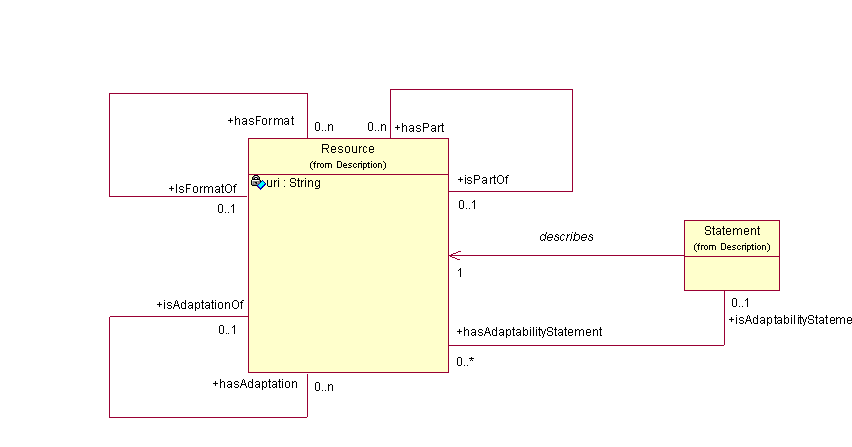
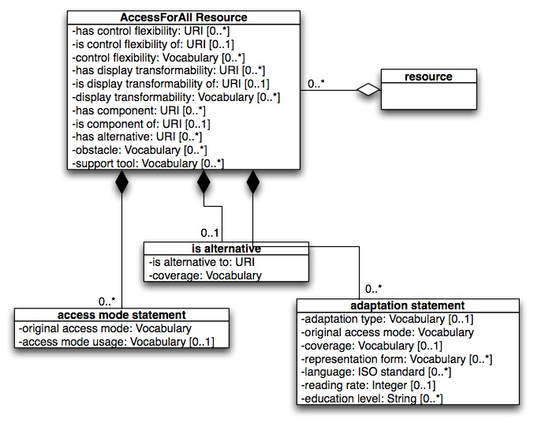

**2012-01-05. Frozen archive - links may not resolve - see directory of files at [MoinMoin wiki archive](/moinmoin-wiki-archive/)**

# > [DiscussionOfFcd](http://dublincore.org/accessibilitywiki/DiscussionOfFcd?action=fullsearch&value=DiscussionOfFcd&literal=1&case=1&context=40 "Click here to do a full-text search for this title")

User

 [UserPreferences](http://dublincore.org/accessibilitywiki/UserPreferences)
  

Site

- [FrontPage](http://dublincore.org/accessibilitywiki/FrontPage)
- [RecentChanges](http://dublincore.org/accessibilitywiki/RecentChanges)
- [FindPage](http://dublincore.org/accessibilitywiki/FindPage)
- [HelpContents](http://dublincore.org/accessibilitywiki/HelpContents)

Page

- [Edit](http://dublincore.org/accessibilitywiki/DiscussionOfFcd?action=edit "Edit")
- [View](http://dublincore.org/accessibilitywiki/DiscussionOfFcd "View")
- [Diffs](http://dublincore.org/accessibilitywiki/DiscussionOfFcd?action=diff "Diffs")
- [Info](http://dublincore.org/accessibilitywiki/DiscussionOfFcd?action=info "Info")
- [Subscribe](http://dublincore.org/accessibilitywiki/DiscussionOfFcd?action=subscribe "Subscribe")
- [Raw](http://dublincore.org/accessibilitywiki/DiscussionOfFcd?action=raw "Raw")
- [Print](http://dublincore.org/accessibilitywiki/DiscussionOfFcd?action=print "Print")

Actions

- [AttachFile](http://dublincore.org/accessibilitywiki/DiscussionOfFcd?action=AttachFile)
- [DSP2XML](http://dublincore.org/accessibilitywiki/DiscussionOfFcd?action=DSP2XML)
- [DeletePage](http://dublincore.org/accessibilitywiki/DiscussionOfFcd?action=DeletePage)
- [LikePages](http://dublincore.org/accessibilitywiki/DiscussionOfFcd?action=LikePages)
- [LocalSiteMap](http://dublincore.org/accessibilitywiki/DiscussionOfFcd?action=LocalSiteMap)
- [SpellCheck](http://dublincore.org/accessibilitywiki/DiscussionOfFcd?action=SpellCheck)

Search

<form method="POST" action="/accessibilitywiki/DiscussionOfFcd">

<input name="action" value="inlinesearch" type="hidden">
<input name="context" value="40" type="hidden">
Title: <input name="text_title" size="15" maxlength="50" type="text"><input src="DiscussionOfFcd_files/moin-search.png" name="button_title" alt="[?]" type="image"> Text: <input name="text_full" size="15" maxlength="50" type="text"><input src="DiscussionOfFcd_files/moin-search.png" name="button_full" alt="[?]" type="image">

</form>

## 2006 Continued Discussion of ISO FCD

### Proposed Changes to DRD

- a hierarchical presentation of classes and vocabs in DRD-FCD ( [DRD-FCD-hierarchy.doc](http://dublincore.org/accessibilitywiki/DiscussionOfFcd?action=AttachFile&do=get&target=DRD-FCD-hierarchy.doc))

- a suggested version of the DRD ( [Draft-AP-7-hierarchy.doc](http://dublincore.org/accessibilitywiki/DiscussionOfFcd?action=AttachFile&do=get&target=Draft-AP-7-hierarchy.doc))

The following links are to two forms that can be used to gather metadata according to the two hierarchies above:

- current version of DRD ( [http://www.ozewai.org/A4A/Draft-AP-6-1.html](http://www.ozewai.org/A4A/Draft-AP-6-1.html))

- proposed version of DRD ( [http://www.ozewai.org/A4A/Draft-AP-6-2.html](http://www.ozewai.org/A4A/Draft-AP-6-2.html))

The following link is to a couple of examples of creating metadata using the Form 2 version - showing some problems... ( [http://www.ozewai.org/A4A/examples-metadata.html](http://www.ozewai.org/A4A/examples-metadata.html)) and the following link is to a summary of comments etc received in response to use of the forms ( [http://www.ozewai.org/A4A/comments-forms.html](http://www.ozewai.org/A4A/comments-forms.html)).

Finally, there are four diagrams below. The first is a UML diagram of the suggested version part1 and the second is part 2.

The third and fourth, labled "DRD as Submitted to ISO," are UML diagrams of the current version of the DRD created by Anastasia.

Alternative proposal UML diagrams:

 

### DRD as Submitted to ISO

 

 [RefreshCache](http://dublincore.org/accessibilitywiki/DiscussionOfFcd?action=refresh&arena=Page.py&key=DiscussionOfFcd.text_html) for this page (cached 2013-01-01 11:33:26)  

Immutable page (last edited 2006-02-13 07:26:09 by Liddy)

