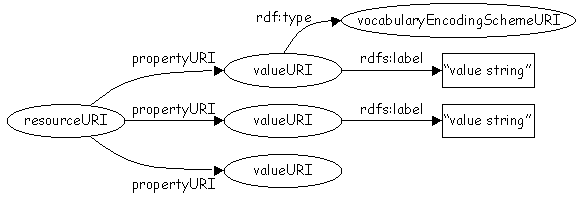
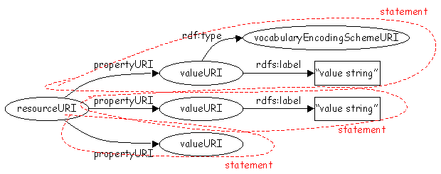
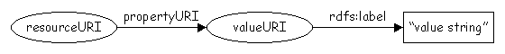
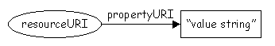
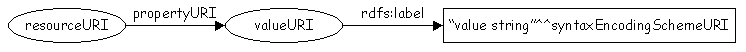
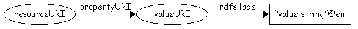
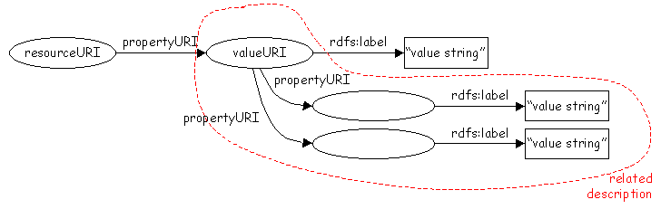

**2012-01-05. Frozen archive - links may not resolve - see directory of files at [MoinMoin wiki archive](/moinmoin-wiki-archive/)**

# > [DCRDFGuidelines](http://dublincore.org/architecturewiki/DCRDFGuidelines?action=fullsearch&value=DCRDFGuidelines&literal=1&case=1&context=40 "Click here to do a full-text search for this title")

User

 [UserPreferences](http://dublincore.org/architecturewiki/UserPreferences)
  

Site

- [FrontPage](http://dublincore.org/architecturewiki/FrontPage)
- [RecentChanges](http://dublincore.org/architecturewiki/RecentChanges)
- [FindPage](http://dublincore.org/architecturewiki/FindPage)
- [HelpContents](http://dublincore.org/architecturewiki/HelpContents)

Page

- [Edit](http://dublincore.org/architecturewiki/DCRDFGuidelines?action=edit "Edit")
- [View](http://dublincore.org/architecturewiki/DCRDFGuidelines "View")
- [Diffs](http://dublincore.org/architecturewiki/DCRDFGuidelines?action=diff "Diffs")
- [Info](http://dublincore.org/architecturewiki/DCRDFGuidelines?action=info "Info")
- [Subscribe](http://dublincore.org/architecturewiki/DCRDFGuidelines?action=subscribe "Subscribe")
- [Raw](http://dublincore.org/architecturewiki/DCRDFGuidelines?action=raw "Raw")
- [Print](http://dublincore.org/architecturewiki/DCRDFGuidelines?action=print "Print")

Actions

- [AttachFile](http://dublincore.org/architecturewiki/DCRDFGuidelines?action=AttachFile)
- [DSP2XML](http://dublincore.org/architecturewiki/DCRDFGuidelines?action=DSP2XML)
- [DeletePage](http://dublincore.org/architecturewiki/DCRDFGuidelines?action=DeletePage)
- [LikePages](http://dublincore.org/architecturewiki/DCRDFGuidelines?action=LikePages)
- [LocalSiteMap](http://dublincore.org/architecturewiki/DCRDFGuidelines?action=LocalSiteMap)
- [SpellCheck](http://dublincore.org/architecturewiki/DCRDFGuidelines?action=SpellCheck)

Search

<form method="POST" action="/architecturewiki/DCRDFGuidelines">

<input name="action" value="inlinesearch" type="hidden">
<input name="context" value="40" type="hidden">
Title: <input name="text_title" size="15" maxlength="50" type="text"><input src="DCRDFGuidelines_files/moin-search.png" name="button_title" alt="[?]" type="image"> Text: <input name="text_full" size="15" maxlength="50" type="text"><input src="DCRDFGuidelines_files/moin-search.png" name="button_full" alt="[?]" type="image">

</form>

***Note: The following text is retained here for historical purposes only. No further editing takes place here.*** 
* * *

## Guidelines for encoding DC metadata using the RDF model

This document is currently under development. It is being worked on by the [DC RDF Taskforce](http://dublincore.org/architecturewiki/DCRDFTaskforce "Self"). Comments should be sent to the [dc-rdf-taskforce@jiscmail.ac.uk](http://www.jiscmail.ac.uk/lists/DC-RDF-TASKFORCE.html) mailing list.

### Introduction

This document provides some recommendations for encoding DC metadata in RDF. It does this by describing how the features of the [DCMI Abstract Model](http://dublincore.org/documents/abstract-model/) are mapped to the RDF model rather than by referring to any specific RDF syntax encoding such as RDF/XML. This will allow DC metadata to be encoded using any of the recognised encoding syntaxes for RDF.

### DCMI Abstract Model summary

The abstract model of DCMI metadata descriptions is as follows:

- A _description_ is made up of one or more _statements_ (about one, and only one, _resource_) and zero or one _resource URI_ (a URI that identifies the _resource_ being described).

- Each _statement_ instantiates a _property/value pair_ and is made up of a _property URI_ (a URI that identifies a _property_), zero or one _value URI_ (a URI that identifies a _value_ of the _property_), zero or one _vocabulary encoding scheme URI_ (a URI that identifies the _class_ of the _value_) and zero or more _value representations_ of the _value_.

- The _value representation_ may take the form of a _value string_ or a _rich representation_.

- Each _value string_ is a simple, human-readable string that is a representation of the _resource_ that is the _value_ of the _property_.

- Each _value string_ may have an associated _syntax encoding scheme URI_ that identifies a _syntax encoding scheme_.

- Each _value string_ may have an associated _value string language_ that is an ISO language tag (e.g. en-GB).

- Each _rich representation_ is some marked-up text, an image, a video, some audio, etc. or some combination thereof that is a representation of the _resource_ that is the _value_ of the _property_.

- Each _value_ may be the subject of a separate _related description_.

- A _description set_ is a set of one or more _descriptions_ about one or more _resources_.

- A DCMI metadata _record_ is a _description set_ that is instantiated according to one of the DCMI encoding guidelines (XHTML meta tags, XML, RDF/XML, etc.)

### Mapping the DCMI Abstract Model to the RDF model

The remainder of this document describes how to represent the DCMI Abstract Model using the RDF model.

#### Descriptions

A DCAM _description_ is represented using an [RDF graph](http://www.w3.org/TR/2004/REC-rdf-concepts-20040210/#section-rdf-graph) originating from a single [RDF subject](http://www.w3.org/TR/2004/REC-rdf-concepts-20040210/#dfn-subject) (a single [RDF node](http://www.w3.org/TR/2004/REC-rdf-concepts-20040210/#dfn-node)), where the [RDF graph](http://www.w3.org/TR/2004/REC-rdf-concepts-20040210/#section-rdf-graph) represents one or more DCAM _statements_ as described below.

#### Statements

A DCAM _statement_ is represented using the [RDF predicate](http://www.w3.org/TR/2004/REC-rdf-concepts-20040210/#dfn-predicate) (also known as the [RDF property](http://www.w3.org/TR/2004/REC-rdf-concepts-20040210/#dfn-property)) and [RDF object](http://www.w3.org/TR/2004/REC-rdf-concepts-20040210/#dfn-object) that make a up an [RDF triple](http://www.w3.org/TR/2004/REC-rdf-concepts-20040210/#section-data-model) originating from the [RDF subject](http://www.w3.org/TR/2004/REC-rdf-concepts-20040210/#dfn-subject) of a DCAM _description_. A DCAM _statement_ may also include an [RDF triple](http://www.w3.org/TR/2004/REC-rdf-concepts-20040210/#section-data-model) that indicates the =rdf:type= of the [RDF object](http://www.w3.org/TR/2004/REC-rdf-concepts-20040210/#dfn-object) (see the "Vocabulary encoding scheme URIs" section below). A DCAM _statement_ may also include one or more [RDF triples](http://www.w3.org/TR/2004/REC-rdf-concepts-20040210/#section-data-model) that indicate a DCAM _value representation_ (see the "Value strings" and "Rich representations" sections below).

#### Resource URIs

A DCAM _resource URI_ is represented using the [RDF URI Reference](http://www.w3.org/TR/2004/REC-rdf-concepts-20040210/#dfn-URI-reference) corresponding the the [RDF subject](http://www.w3.org/TR/2004/REC-rdf-concepts-20040210/#dfn-subject) of a DCAM _description_.

#### Property URIs

A DCAM _property URI_ is represented using the [RDF URI Reference](http://www.w3.org/TR/2004/REC-rdf-concepts-20040210/#dfn-URI-reference) corresponding to the [RDF predicate](http://www.w3.org/TR/2004/REC-rdf-concepts-20040210/#dfn-predicate) of an [RDF triple](http://www.w3.org/TR/2004/REC-rdf-concepts-20040210/#section-data-model) originating from the [RDF subject](http://www.w3.org/TR/2004/REC-rdf-concepts-20040210/#dfn-subject) of a DCAM _description_.

#### Value URIs

A DCAM _value URI_ is represented using the [RDF URI Reference](http://www.w3.org/TR/2004/REC-rdf-concepts-20040210/#dfn-URI-reference) corresponding to the [RDF object](http://www.w3.org/TR/2004/REC-rdf-concepts-20040210/#dfn-object) of an [RDF triple](http://www.w3.org/TR/2004/REC-rdf-concepts-20040210/#section-data-model) originating from the [RDF subject](http://www.w3.org/TR/2004/REC-rdf-concepts-20040210/#dfn-subject) of a DCAM _description_.

#### Vocabulary encoding scheme URIs

A DCAM _vocabulary encoding scheme_ is represented using an [RDF triple](http://www.w3.org/TR/2004/REC-rdf-concepts-20040210/#section-data-model) comprising:

- an [RDF subject](http://www.w3.org/TR/2004/REC-rdf-concepts-20040210/#dfn-subject) that is the [RDF object](http://www.w3.org/TR/2004/REC-rdf-concepts-20040210/#dfn-object) of an [RDF triple](http://www.w3.org/TR/2004/REC-rdf-concepts-20040210/#section-data-model) originating from the [RDF subject](http://www.w3.org/TR/2004/REC-rdf-concepts-20040210/#dfn-subject) of a DCAM _description_

- an [RDF predicate](http://www.w3.org/TR/2004/REC-rdf-concepts-20040210/#dfn-predicate) that is =rdf:type=

- an [RDF URI Reference](http://www.w3.org/TR/2004/REC-rdf-concepts-20040210/#dfn-URI-reference) corresponding to the [RDF object](http://www.w3.org/TR/2004/REC-rdf-concepts-20040210/#dfn-object) that is the DCAM _vocabulary encoding scheme_

#### Value strings

A DCAM _value string_ is represented using an [RDF triple](http://www.w3.org/TR/2004/REC-rdf-concepts-20040210/#section-data-model) comprising:

- an [RDF subject](http://www.w3.org/TR/2004/REC-rdf-concepts-20040210/#dfn-subject) that is the [RDF object](http://www.w3.org/TR/2004/REC-rdf-concepts-20040210/#dfn-object) of an [RDF triple](http://www.w3.org/TR/2004/REC-rdf-concepts-20040210/#section-data-model) originating from the [RDF subject](http://www.w3.org/TR/2004/REC-rdf-concepts-20040210/#dfn-subject) of a DCAM _description_

- an [RDF predicate](http://www.w3.org/TR/2004/REC-rdf-concepts-20040210/#dfn-predicate) that is =rdfs:label=

- an [RDF literal](http://www.w3.org/TR/2004/REC-rdf-concepts-20040210/#dfn-literal) [RDF object](http://www.w3.org/TR/2004/REC-rdf-concepts-20040210/#dfn-object) (an [RDF plain literal](http://www.w3.org/TR/2004/REC-rdf-concepts-20040210/#dfn-plain-literal) or [RDF typed literal](http://www.w3.org/TR/2004/REC-rdf-concepts-20040210/#dfn-typed-literal)).

Note that in those cases where the range of the DCAM _property_ is =rdfs:Literal= a shorter representation is possible by using an [RDF literal](http://www.w3.org/TR/2004/REC-rdf-concepts-20040210/#dfn-literal) that is the [RDF object](http://www.w3.org/TR/2004/REC-rdf-concepts-20040210/#dfn-object) of an [RDF triple](http://www.w3.org/TR/2004/REC-rdf-concepts-20040210/#section-data-model) whose [RDF subject](http://www.w3.org/TR/2004/REC-rdf-concepts-20040210/#dfn-subject) is the [RDF subject](http://www.w3.org/TR/2004/REC-rdf-concepts-20040210/#dfn-subject) of the DCAM _description_.

#### Rich representations

A DCAM _rich representation_ is represented using a DCAM _value string_ that is an [RDF typed literal](http://www.w3.org/TR/2004/REC-rdf-concepts-20040210/#dfn-typed-literal).

#### Syntax encoding scheme URIs

A DCAM _syntax encoding scheme_ is represented using the [RDF URI Reference](http://www.w3.org/TR/2004/REC-rdf-concepts-20040210/#dfn-URI-reference) that is the [RDF datatype URI](http://www.w3.org/TR/2004/REC-rdf-concepts-20040210/#dfn-datatype-URI) associated with an [RDF typed literal](http://www.w3.org/TR/2004/REC-rdf-concepts-20040210/#dfn-typed-literal) DCAM _value string_.

#### Value string languages

A DCAM _value string language_ is represented using a language tag as defined by RFC-3066, normalized to lowercase, associated with the [RDF plain literal](http://www.w3.org/TR/2004/REC-rdf-concepts-20040210/#dfn-plain-literal) that is the DCAM _value string_.

_Note that in the RDF model, a language tag can only be associated with an RDF plain literal, not with an RDF typed literal. This is a limitation on the DCAM as it is currently worded. We may want to consider tightening up the wording of the DCAM at some point?_

#### Related descriptions

A DCAM _related description_ is represented using any [RDF Graph](http://www.w3.org/TR/2004/REC-rdf-concepts-20040210/#section-rdf-graph) that originates from an [RDF node](http://www.w3.org/TR/2004/REC-rdf-concepts-20040210/#dfn-node) that is not the [RDF subject](http://www.w3.org/TR/2004/REC-rdf-concepts-20040210/#dfn-subject) of the DCAM _description_.

#### Description sets

A DCAM _description set_ is represented as an [RDF Graph](http://www.w3.org/TR/2004/REC-rdf-concepts-20040210/#section-rdf-graph) that includes one or more DCAM _descriptions_ as described above.

#### Records

A DCAM _record_ is an [RDF Graph](http://www.w3.org/TR/2004/REC-rdf-concepts-20040210/#section-rdf-graph) that is encoded using any of the recognised RDF encoding syntaxes.

### Appendix A: A note about dumb-down

The dumb-down algorithm is applied to a DC _description set_ (in terms of the DCAM), not directly to an RDF graph. Therefore, applying the dumb-down algorithm to a DC/RDF graph should be done by first mapping the graph to a DC _description set_, then applying the dumb-down algorithm, then mapping the resulting DC _description_ back to a DC/RDF graph.

### Appendix B: A few examples using the RDF/XML syntax

* * *

Note: The figures used in this document are available in a [MS-Powerpoint file](http://dublincore.org/architecturewiki/DCRDFGuidelines?action=AttachFile&do=get&target=dc-rdf-diagrams.ppt).

 [RefreshCache](http://dublincore.org/architecturewiki/DCRDFGuidelines?action=refresh&arena=Page.py&key=DCRDFGuidelines.text_html) for this page (cached 2013-01-01 12:28:18)  

Immutable page (last edited 2006-05-24 10:57:23 by MikaelNilsson)

