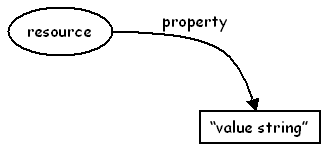
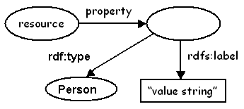

**2012-01-05. Frozen archive - links may not resolve - see directory of files at [MoinMoin wiki archive](/moinmoin-wiki-archive/)**

# > [DCRDFTaskforce/DCRDFExecutiveSummary3](http://dublincore.org/architecturewiki/DCRDFTaskforce_2fDCRDFExecutiveSummary3?action=fullsearch&value=%2FDCRDFExecutiveSummary3&literal=1&case=1&context=40 "Click here to do a full-text search for this title")

User

 [UserPreferences](http://dublincore.org/architecturewiki/UserPreferences)
  

Site

- [FrontPage](http://dublincore.org/architecturewiki/FrontPage)
- [RecentChanges](http://dublincore.org/architecturewiki/RecentChanges)
- [FindPage](http://dublincore.org/architecturewiki/FindPage)
- [HelpContents](http://dublincore.org/architecturewiki/HelpContents)

Page

- [Up](http://dublincore.org/architecturewiki/DCRDFTaskforce "Up")
- [Edit](http://dublincore.org/architecturewiki/DCRDFTaskforce_2fDCRDFExecutiveSummary3?action=edit "Edit")
- [View](http://dublincore.org/architecturewiki/DCRDFTaskforce_2fDCRDFExecutiveSummary3 "View")
- [Diffs](http://dublincore.org/architecturewiki/DCRDFTaskforce_2fDCRDFExecutiveSummary3?action=diff "Diffs")
- [Info](http://dublincore.org/architecturewiki/DCRDFTaskforce_2fDCRDFExecutiveSummary3?action=info "Info")
- [Subscribe](http://dublincore.org/architecturewiki/DCRDFTaskforce_2fDCRDFExecutiveSummary3?action=subscribe "Subscribe")
- [Raw](http://dublincore.org/architecturewiki/DCRDFTaskforce_2fDCRDFExecutiveSummary3?action=raw "Raw")
- [Print](http://dublincore.org/architecturewiki/DCRDFTaskforce_2fDCRDFExecutiveSummary3?action=print "Print")

Actions

- [AttachFile](http://dublincore.org/architecturewiki/DCRDFTaskforce_2fDCRDFExecutiveSummary3?action=AttachFile)
- [DSP2XML](http://dublincore.org/architecturewiki/DCRDFTaskforce_2fDCRDFExecutiveSummary3?action=DSP2XML)
- [DeletePage](http://dublincore.org/architecturewiki/DCRDFTaskforce_2fDCRDFExecutiveSummary3?action=DeletePage)
- [LikePages](http://dublincore.org/architecturewiki/DCRDFTaskforce_2fDCRDFExecutiveSummary3?action=LikePages)
- [LocalSiteMap](http://dublincore.org/architecturewiki/DCRDFTaskforce_2fDCRDFExecutiveSummary3?action=LocalSiteMap)
- [SpellCheck](http://dublincore.org/architecturewiki/DCRDFTaskforce_2fDCRDFExecutiveSummary3?action=SpellCheck)

Search

<form method="POST" action="/architecturewiki/DCRDFTaskforce_2fDCRDFExecutiveSummary3">

<input name="action" value="inlinesearch" type="hidden">
<input name="context" value="40" type="hidden">
Title: <input name="text_title" size="15" maxlength="50" type="text"><input src="DCRDFTaskforce_2fDCRDFExecutiveSummary3_files/moin-search.png" name="button_title" alt="[?]" type="image"> Text: <input name="text_full" size="15" maxlength="50" type="text"><input src="DCRDFTaskforce_2fDCRDFExecutiveSummary3_files/moin-search.png" name="button_full" alt="[?]" type="image">

</form>

***Note: The following text is retained here for historical purposes only. No further editing takes place here.*** 
* * *

## Dublin Core metadata in RDF: implications of new guidelines for legacy implementations

### About this note

DCMI is currently considering the assignment of domains and ranges to DCMI metadata terms. Such a step would have important implications for the interpretation of legacy metadata. This note presents a high-level view of the issue and its implications. ***No such changes will be undertaken by DCMI until their impact has been well understood and discussed in a public comment period.*** Implementers with an opinion about the issues presented here are invited to participate in discussion on the DCMI Architecture Working Group mailing list ( [http://www.jiscmail.ac.uk/lists/dc-architecture.html](http://www.jiscmail.ac.uk/lists/dc-architecture.html)).

The addition of domains and ranges would help clarify the semantics of DCMI properties in a formal sense. It should be noted, however, that this would have practical consequences only for the creation and interpretation of Dublin Core metadata in RDF. Metadata creators would need to add a few extra angle brackets to ensure that RDF-consuming applications interpret value strings as properties of nodes; and metadata consumers might need to "special-case" the processing of value strings associated directly with Dublin Core properties (i.e., without intervening nodes). The generation of Dublin Core metadata in RDF would become slightly more complex for anyone producing metadata by hand. However, these measures would eliminate the current ambiguity, enabling metadata that is mappable more consistently to the DCAM and improved support by tools thanks to machine-processable restrictions.

The expression of Dublin Core metadata in the other recommended formats recommended by DCMI -- i.e., "Expressing Dublin Core in HTML/XHTML meta and link elements" ( [http://dublincore.org/documents/dcq-html](http://dublincore.org/documents/dcq-html)) and the existing "Guidelines for implementing Dublin Core in XML" ( [http://dublincore.org/documents/dc-xml-guidelines](http://dublincore.org/documents/dc-xml-guidelines)) -- would not be negatively affected by these developments. The rules for interpreting metadata in these syntaxes in terms of the DCAM are simpler than for RDF, as they are not bound by the semantics of RDF.

### Historical context

Since 1997, the "Dublin Core data model" has evolved in a process of mutual influence with W3C's Resource Description Framework (RDF). This process has resulted in the DCMI Abstract Model, which was published in 2005 as a DCMI Recommendation ([[http://dublincore.org/documents/abstract-model/](http://dublincore.org/documents/abstract-model/) (1)]. The DCMI Abstract Model now provides a reference model on the basis of which particular DC encoding guidelines ( [(2)](http://dublincore.org/resources/expressions/)) can be defined.

DCMI currently has two specifications for expressing Dublin Core metadata in RDF. The first, "Expressing Simple Dublin Core in RDF/XML", or "DC-Simple-in-RDF" for short ( [(3)](http://dublincore.org/documents/dcmes-xml/)) became a DCMI Recommendation in 2002. The second, "Expressing Qualified Dublin Core in RDF/XML", or "DC-Qualified-in-RDF" ( [(4)](http://dublincore.org/documents/dcq-rdf-xml/)), has been a DCMI Proposed Recommendation since 2002.

### Current developments

The RDF Task Force of the DCMI Architecture Working Group is currently drafting a document which is intended to replace these two legacy specifications with a single consolidated and updated DCMI Recommendation for expressing Dublin Core in RDF ([[http://dublincore.org/architecturewiki/DCRDFGuidelines](http://dublincore.org/architecturewiki/DCRDFGuidelines) (5)]).

This process has important implications for how DCMI "defines" its metadata terms. DCMI metadata terms have hitherto been defined entirely in natural language; the RDF expression of the DCMI term set (e.g., [(6)](http://dublincore.org/2003/03/24/dces#title)) served essentially to convey these English-language definitions in a form ingestable by RDF applications. As part of the process of clarifying the RDF expression for Dublin Core metadata, the RDF Task Force has recommended that DCMI supplement these English-language definitions with machine-understandable definitions of the "domain" and "range" of DCMI metadata terms ([[http://dublincore.org/architecturewiki/DCPropertyDomainsRanges](http://dublincore.org/architecturewiki/DCPropertyDomainsRanges) (5)]). Such additional, machine-understandable precision is necessary as Dublin Core is deployed in the context of inference engines and ontology-based solutions.

For most DCMI metadata terms, the process of clarifying domains and ranges machine-understandably is straightforward and unambiguous. However, one problem with regard to legacy metadata usage is serious enough to bear closer consideration. In the early years, the Dublin Core community distinguished between Simple and Qualified Dublin Core -- a distinction which was reflected in the difference between the specifications "DC-Simple-in-RDF" and the "DC-Qualified-in-RDF".

The two legacy specifications differ with regard to whether properties such as dc:creator and dc:date have values that are resources (e.g., a Person or a Date, seen as entities), or strings representing the resources (i.e., a value string). In "DC-Simple-in-RDF", a dc:creator is a name:

<pre>&lt;http://www.example.com&gt; dc:creator "John Smith".
</pre>

In "DC-Qualified-in-RDF", in contrast, a dc:creator is an entity, as in:

<pre>&lt;http://www.example.com&gt; dc:creator &lt;http://www.example.org/person32&gt;
</pre>

or

<pre>&lt;http://www.example.com&gt; dc:creator _:xxx.
_:xxx rdf:type foaf:Person
_:xxx dcrdf:valueString "John Smith"
</pre>

These two contrasting approaches may be pictured as follows:

<table>
  <tbody>
    <tr>
      <td align="center">
         </td>
      <td align="center">
         </td>
    </tr>
    <tr>
      <td align="center">
        Figure 1 </td>
      <td align="center">
        Figure 2 </td>
    </tr>
  </tbody>
</table>

The current draft DC-in-RDF specification under development follows the latter approach -- dc:creator refers to an entity which can be identified (e.g., in an authority file) and described in its own right (e.g., with a name, an affiliation, and a birth date). The English-language definitions of these terms bear out this interpretation; dc:creator is "an entity primarily responsible for making the content of the resource", examples being "a person, an organization, or a service". However, the usage comments associated with these definitions also reflect the ambiguity: "Typically, the name of a Creator should be used to indicate the entity".

In accordance with the current approach, the DCMI Usage Board would assign a range of "Agent" to dc:creator and dc:contributor, where "Agent" would be defined as "the class of all things that are a Person, Organization, or Service". If it is used at all, the range "Literal" would apply only to metadata terms which are typically associated with value strings, such as dc:title. In most cases, the ranges to be defined are reasonably obvious given usage patterns in practice.

Due to the ambiguous usage of dc:creator and dc:contributor over the years, however, the assignment of any range would make one or another part of the legacy metadata appear invalid in the context of machine processing. Declaring "Agent" as the range of dc:creator will mean that inferencing applications will expect to treat the value of the dc:creator property as an entity. Where metadata represents names as literal values for dc:creator, applications will need to treat these as "special cases" in order to merge them with metadata which associate those names with the expected entity constructs.

The existing specifications from the DCMI have not taken these applications into account, which has resulted in an unknown amount of Dublin Core-based RDF data that is inconsistent with the definitions of the Dublin Core properties. The DC-RDF taskforce has judged that the mentioned changes are necessary, albeit painful, to ensure the long-term viability of Dublin Core in RDF.

### References

1. 

[Expressing Simple Dublin Core in RDF/XML](http://dublincore.org/documents/dcmes-xml/), DCMI Recommendation, 2002-07-31

2. 

[Expressing Qualified Dublin Core in RDF / XML](http://dublincore.org/documents/dcq-rdf-xml/), DCMI Proposed Recommandation, 2002-05-15

3. 

[Expressing Dublin Core Metadata in RDF](http://dublincore.org/architecturewiki/DCRDFGuidelines), Working Draft

4. 

[Release Notes](http://dublincore.org/architecturewiki/DCRDFTaskforce/DCRDFReleasenotes) for above draft.

 [RefreshCache](http://dublincore.org/architecturewiki/DCRDFTaskforce_2fDCRDFExecutiveSummary3?action=refresh&arena=Page.py&key=DCRDFTaskforce_2fDCRDFExecutiveSummary3.text_html) for this page (cached 2012-12-22 22:22:43)  

Immutable page (last edited 2006-05-24 11:02:17 by MikaelNilsson)

