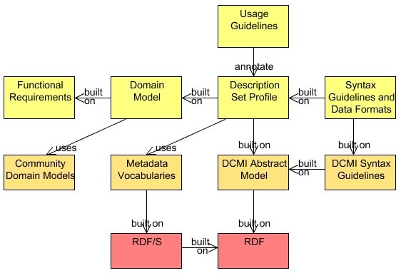

**2012-01-05. Frozen archive - links may not resolve - see directory of files at [MoinMoin wiki archive](/moinmoin-wiki-archive/)**

# > [DescriptionSetProfile](http://dublincore.org/architecturewiki/DescriptionSetProfile?action=fullsearch&value=DescriptionSetProfile&literal=1&case=1&context=40 "Click here to do a full-text search for this title")

User

 [UserPreferences](http://dublincore.org/architecturewiki/UserPreferences)
  

Site

- [FrontPage](http://dublincore.org/architecturewiki/FrontPage)
- [RecentChanges](http://dublincore.org/architecturewiki/RecentChanges)
- [FindPage](http://dublincore.org/architecturewiki/FindPage)
- [HelpContents](http://dublincore.org/architecturewiki/HelpContents)

Page

- [Edit](http://dublincore.org/architecturewiki/DescriptionSetProfile?action=edit "Edit")
- [View](http://dublincore.org/architecturewiki/DescriptionSetProfile "View")
- [Diffs](http://dublincore.org/architecturewiki/DescriptionSetProfile?action=diff "Diffs")
- [Info](http://dublincore.org/architecturewiki/DescriptionSetProfile?action=info "Info")
- [Subscribe](http://dublincore.org/architecturewiki/DescriptionSetProfile?action=subscribe "Subscribe")
- [Raw](http://dublincore.org/architecturewiki/DescriptionSetProfile?action=raw "Raw")
- [Print](http://dublincore.org/architecturewiki/DescriptionSetProfile?action=print "Print")

Actions

- [AttachFile](http://dublincore.org/architecturewiki/DescriptionSetProfile?action=AttachFile)
- [DSP2XML](http://dublincore.org/architecturewiki/DescriptionSetProfile?action=DSP2XML)
- [DeletePage](http://dublincore.org/architecturewiki/DescriptionSetProfile?action=DeletePage)
- [LikePages](http://dublincore.org/architecturewiki/DescriptionSetProfile?action=LikePages)
- [LocalSiteMap](http://dublincore.org/architecturewiki/DescriptionSetProfile?action=LocalSiteMap)
- [SpellCheck](http://dublincore.org/architecturewiki/DescriptionSetProfile?action=SpellCheck)

Search

<form method="POST" action="/architecturewiki/DescriptionSetProfile">

<input name="action" value="inlinesearch" type="hidden">
<input name="context" value="40" type="hidden">
Title: <input name="text_title" size="15" maxlength="50" type="text"><input src="DescriptionSetProfile_files/moin-search.png" name="button_title" alt="[?]" type="image"> Text: <input name="text_full" size="15" maxlength="50" type="text"><input src="DescriptionSetProfile_files/moin-search.png" name="button_full" alt="[?]" type="image">

</form>

**NOTE: This draft is not currently being edited - please see [http://dublincore.org/documents/2008/03/31/dc-dsp/](http://dublincore.org/documents/2008/03/31/dc-dsp/).**

## DCMI Description Set Profile

**Important** : This document is currently in draft. Comments should please be sent to [DC-ARCHITECTURE@JISCMAIL.AC.UK](mailto:DC-ARCHITECTURE@JISCMAIL.AC.UK) ( [Subscription and archives](http://www.jiscmail.ac.uk/archives/dc-architecture.html)) .

**Editor:** Mikael Nilsson < [mikael@nilsson.name](mailto:mikael@nilsson.name)>

- [DCAP model as Powerpoint](http://dublincore.org/architecturewiki/DescriptionSetProfile?action=AttachFile&do=get&target=dcap-model.ppt)

- [DCAP model as PDF printout](http://dublincore.org/architecturewiki/DescriptionSetProfile?action=AttachFile&do=get&target=dcap-model_printout.pdf)

<table>
  <tbody>
    <tr>
      <td bgcolor="#cef2f2">
        <ol>
          <li>
            <a href="#head-b698c11e84460ed5999bfeb5cbf25b865c238f3c">TODO</a>
          </li>
          <li>
            <a href="#head-72931b284bc845563c1f38ed0f0916064d6505dd">Issues so far</a>
          </li>
          <li>
            <a href="#head-2473e96bc614a911821242119918a241a41836d6">Introduction</a>
          </li>
          <li>
            <a href="#head-94bce4763929db0e4adbabe12da62871390bbc58">Basic structure</a>
          </li>
          <li>
            <a href="#head-523b5b4ba74779863e0fddd2ac3e9c9519c09d8d">Basic semantics</a>
          </li>
          <li>
            <a href="#head-950d9c1aee5a0b8ac1664c8a9f40a8cddde14c8b">Usage examples</a>
          </li>
          <ol>
            <li>
              <a href="#head-62c805f3cba989a137be1ed43733387d33498409">Example 1: Constraining the resource</a>
            </li>
            <li>
              <a href="#head-885184f1532cdb561f48700b42531e07f42b291e">Example 2: Constraining a property</a>
            </li>
            <li>
              <a href="#head-ecf7e2f0304e62ee237a106af35c4e68d392158a">Example 3: Constraining the value</a>
            </li>
            <li>
              <a href="#head-020bd1db5b1b27ad0482ae1e252cd30d623dd0ed">Example 4: Two resources</a>
            </li>
          </ol>
          <li>
            <a href="#head-73b00486a2accebac7d388733ee6a7334cf016aa">Description Templates</a>
          </li>
          <ol>
            <li>
              <a href="#head-06b6ace8ca3f18249e8ba4ea9090c0f34564ce1c">Identifier</a>
            </li>
            <li>
              <a href="#head-1d10323c27ec5f9982ad73377fd582ff949840f8">Standalone</a>
            </li>
            <li>
              <a href="#head-3804483c17f0ca6d8669e19c58173a41eaa3d613">Minimum occurrence constraint</a>
            </li>
            <li>
              <a href="#head-1423b7137b7adcb64fdd867267a6f01f0c1a850e">Maximum occurrence constraint</a>
            </li>
            <li>
              <a href="#head-60e478f3ffc7b43c729b3fcc51ed46b0b8152b5c">Resource Class Membership Constraint</a>
            </li>
          </ol>
          <li>
            <a href="#head-5159f8967f111d1c1d4534655ae29caed9bfa3e0">Statement templates</a>
          </li>
          <ol>
            <li>
              <a href="#head-3804483c17f0ca6d8669e19c58173a41eaa3d613-2">Minimum occurrence constraint</a>
            </li>
            <li>
              <a href="#head-1423b7137b7adcb64fdd867267a6f01f0c1a850e-2">Maximum occurrence constraint</a>
            </li>
            <li>
              <a href="#head-e1f4f88a502b2e1354d3373f7da1a019e3d21096">Type constraint</a>
            </li>
            <li>
              <a href="#head-803c6e5926d197879c4421a15fe8d25e4724a4ef">Property constraints</a>
            </li>
            <ol>
              <li>
                <a href="#head-0b82d9299adc3e79dc91d0b983893704d8dc7d39">Property list constraint</a>
              </li>
              <li>
                <a href="#head-577970040cf368548eed7d5c3c46afb4f6f0ae57">Sub-property constraint</a>
              </li>
            </ol>
            <li>
              <a href="#head-a956b3a98ea091ebcd800518eaaee2489610bdec">Literal value constraints</a>
            </li>
            <ol>
              <li>
                <a href="#head-f5fd9809a0ba086a803987ad7b5922bcfb172710">Literal list constraint</a>
              </li>
              <li>
                <a href="#head-53f6c2aa65f908b20f58768caff6f8dabf6f55c4">Literal language constraint</a>
              </li>
              <li>
                <a href="#head-b104a5a741f0b821dd8f93d10ee22a9c317eb992">Literal language list constraint</a>
              </li>
              <li>
                <a href="#head-6e22213bfb7340e8abcf500a19618968e30a4edd">Syntax Encoding Scheme constraint</a>
              </li>
              <li>
                <a href="#head-7418b20b39d32907d2d2e4772f04918effc8c5c5">Syntax Encoding Scheme list constraint</a>
              </li>
            </ol>
            <li>
              <a href="#head-87a4e839141cffc88091c1d2d57eaaf3ba1c5205">Non-literal value constraints</a>
            </li>
            <ol>
              <li>
                <a href="#head-07e616fc66e6f1ce7b6187bc39137de323fed699">Description template reference</a>
              </li>
              <li>
                <a href="#head-e55a7107284b0550fc61410b1c6f4fb85e8e322e">Class membership constraint</a>
              </li>
              <li>
                <a href="#head-b81227bf6e852af03f26894eeb7ccf32ee1fbd4f">Value URI constraint</a>
              </li>
              <ol>
                <li>
                  <a href="#head-fda559a6e7de3ce0f99a7545f2215ca67fed4400">Value URI occurrence constraint</a>
                </li>
                <li>
                  <a href="#head-bd585eadb681af3240bf70a3f94abe32f1051a9f">Value URI list constraint</a>
                </li>
              </ol>
              <li>
                <a href="#head-8d505c599b3ad6bc0dd4b147774b857818018d8e">Vocabulary encoding scheme constraint</a>
              </li>
              <ol>
                <li>
                  <a href="#head-288ad4208b5b4af9bdd8aee7dd9bde09fb94ebe5">Vocabulary encoding scheme occurrence constraint</a>
                </li>
                <li>
                  <a href="#head-09394287a03131cbaaabc69a231f07cf1932c236">Vocabulary encoding scheme list constraint</a>
                </li>
              </ol>
              <li>
                <a href="#head-c5f08278e94114cfa637f996b6c756477e032897">Value String Constraints</a>
              </li>
              <ol>
                <li>
                  <a href="#head-3804483c17f0ca6d8669e19c58173a41eaa3d613-3">Minimum occurrence constraint</a>
                </li>
                <li>
                  <a href="#head-1423b7137b7adcb64fdd867267a6f01f0c1a850e-3">Maximum occurrence constraint</a>
                </li>
                <li>
                  <a href="#head-bd3a5262fa4c54db9369a69cad74b55a43a5b159">Other constraints</a>
                </li>
              </ol>
            </ol>
          </ol>
          <li>
            <a href="#head-966b68d57e724755459d2504e7bc816ee7563732">XML structure</a>
          </li>
          <li>
            <a href="#head-4d5dd2fe0960c0c57448adb3996e9d50d1666993">RDF variant</a>
          </li>
          <li>
            <a href="#head-eb01bf04c9a0e8a71c45816513df424f1c7ffedb">Examples</a>
          </li>
          <li>
            <a href="#head-0441a95b1d0d8e30874a4495b77aa328b0e00cb3">Simple FOAF</a>
          </li>
        </ol>
      </td>
    </tr>
  </tbody>
</table>

### 1. TODO

- Add hotlinks to DCAM concepts

### 2. Issues so far

- Simultaneous subproperty and property list constraints?

- nonliteral constraint in the case type=unspecified.

- class constraint, relating descriptions and "standalone" descriptions

- description template matching based only on resource type, not path.

### 3. Introduction

The DCMI Description Set Profile specification describes an information model and XML expression of a "Description Set Profile" (DSP). The term _description set_ and the associated concepts used in this specification are defined as in the DCMI Abstract model [[DCAM](http://dublincore.org/documents/abstract-model)].

A DSP is a way of describing structural constraints on a description set. It constrains the resources that may be described by descriptions in the description set, the properties that may be used, and the ways a value surrogate may be given.

A DSP can be used for many different purposes, such as:

- as a formal representation of the constraints of a Dublin Core Application Profile

- as configuration for databases

- as configuration for metadata editing tools

- etc.

A DSP does _not_ address the following:

- Human-readable documentation.

- Definition of vocabularies.

- Version control.

A DSP contains the formal syntactic constraints only, and will need to be combined with human-readable information, usage guidelines, version management, etc. in order to be used as an application profile. However, the design of the DSP information model is intended to facilitate the merging of DSP information and external information of the above kinds, for example by tools generating human-readable documentation for a Dublin Core Application Profile.

A Dublin Core Application Profile is a document, or set of documents, that puts a Description Set Profile into a broader context of Functional Requirements, Domain Models (such as Functional Requirements for Bibliographic Records), guidelines on syntax and usage, and possibly data formats. The following figure depicts the basic elements of a Dublin Core Application Profile (this model will be elaborated in future documents).

### 4. Basic structure

A DSP describes the structure of a Description Set by using the notions of "templates" and "constraints". A template describes the possible metadata structures in a conforming record.

There are two levels of templates in a Description Set Profile:

- **Description templates** , that contains the statement templates that apply to a single kind of description as well as constraints on the described resource.

- **Statement templates** , that contains all the constraints on the property, value strings, vocabulary encoding schemes, etc. that apply to a single kind of statement.

While templates are used to express structures, constraints are used to limit those structures. The following figure depicts the basic elements of the structure.

### 5. Basic semantics

The fundamental usage model for a DSP is to examine whether a metadata record _matches_ the DSP.

Matching of a description set is defined as follows:

<dl>

    <dt> Binding of descriptions to description templates</dt>
<dd>

Each description is bound to a Description Template by evaluating the <em>Resource Constraint</em>
 of each Description Template against the described resource. Each 
description must be bound to exactly one Description Template. 

</dd>
    <dt> Binding of statements to statement templates</dt>
<dd>

For each description, each statement is bound to a Statement Templates 
in the corresponding Description Template by evaluating the <em>Property Constraint</em>. Each statement must be bound to exactly one Statement Template. 

</dd>
    <dt> Evaluating constraints</dt>
<dd>

Now that all metadata in the description set has been bound to a template, all constraints can be verified. 

</dd>

    </dl>

### 6. Usage examples

#### 6.1. Example 1: Constraining the resource

The following DSP matches descriptions with a single resource. The resource must be an instance of <tt>foaf:Person</tt>.

<pre>&lt;?xml version="1.0" ?&gt;

&lt;DescriptionSetTemplate xmlns="http://dublincore.org/xml/dc-dsp/2008/01/14" &gt;

  &lt;DescriptionTemplate ID="person" minOccurs="1" maxOccurs="1" standalone="yes"&gt;
    
    &lt;ResourceClass&gt;http://xmlns.com/foaf/0.1/Person&lt;/ResourceClass&gt;

  &lt;/DescriptionTemplate&gt;

&lt;/DescriptionSetTemplate&gt;

</pre>

As it stands, this DSP does not allow for the description of that resource to contain any statements, so it is not very useful.

#### 6.2. Example 2: Constraining a property

The following DSP adds a mandatory foaf:name property with a literal value to the previous example.

<pre>&lt;?xml version="1.0" ?&gt;

&lt;DescriptionSetTemplate xmlns="http://dublincore.org/xml/dc-dsp/2008/01/14"&gt;

  &lt;DescriptionTemplate ID="person" minOccurs="1" maxOccurs="1" standalone="yes"&gt;
    
   &lt;ResourceClass&gt;http://xmlns.com/foaf/0.1/Person&lt;/ResourceClass&gt;

    &lt;StatementTemplate minOccurs="1" maxOccurs="1" type="literal"&gt;

      &lt;Property&gt;http://xmlns.com/foaf/0.1/name&lt;/Property&gt;

    &lt;/StatementTemplate&gt;

  &lt;/DescriptionTemplate&gt;

&lt;/DescriptionSetTemplate&gt;

</pre>

#### 6.3. Example 3: Constraining the value

The following DSP constrains the value to be a literal without a language.

<pre>&lt;?xml version="1.0" ?&gt;

&lt;DescriptionSetTemplate xmlns="http://dublincore.org/xml/dc-dsp/2008/01/14"&gt;

  &lt;DescriptionTemplate ID="person" minOccurs="1" maxOccurs="1" standalone="yes"&gt;
    
    &lt;ResourceClass&gt;http://xmlns.com/foaf/0.1/Person&lt;/ResourceClass&gt;

    &lt;StatementTemplate minOccurs="1" maxOccurs="1" type="literal"&gt;

      &lt;Property&gt;http://xmlns.com/foaf/0.1/name&lt;/Property&gt;

      &lt;LiteralConstraint&gt;
        &lt;LanguageOccurrence&gt;disallowed&lt;/LanguageOccurrence&gt;
      &lt;/LiteralConstraint&gt;

    &lt;/StatementTemplate&gt;

  &lt;/DescriptionTemplate&gt;

&lt;/DescriptionSetTemplate&gt;

</pre>

#### 6.4. Example 4: Two resources

The following DSP allows for two kinds of resources: a single "document", and multiple "authors". The Person resources may only occur as values of the <tt>dcterms:creator</tt> property, not stand-alone. The value may only be described in a separate description with a mandatory <tt>foaf:name</tt> property.

<pre>&lt;?xml version="1.0" ?&gt;

&lt;DescriptionSetTemplate xmlns="http://dublincore.org/xml/dc-dsp/2008/01/14"&gt;

  &lt;DescriptionTemplate ID="document" minOccurs="1" maxOccurs="1" standalone="yes"&gt;

    &lt;ResourceClass&gt;http://purl.org/dc/terms/Text&lt;/ResourceClass&gt;

    &lt;StatementTemplate minOccurs="1" type="nonliteral"&gt;

      &lt;Property&gt;http://purl.org/dc/terms/creator&lt;/Property&gt;

      &lt;NonLiteralConstraint descriptionTemplateID="person"&gt;
        &lt;ValueURIOccurrence&gt;disallowed&lt;/ValueURIOccurrence&gt;
        &lt;VocabularyEncodingSchemeOccurrence&gt;disallowed&lt;/VocabularyEncodingSchemeOccurrence&gt;
        &lt;ValueStringConstraint maxOccur="0"/&gt;
      &lt;/NonLiteralConstraint&gt;

    &lt;/StatementTemplate&gt;

  &lt;/DescriptionTemplate&gt;

  &lt;DescriptionTemplate ID="person" standalone="no"&gt;
    
    &lt;ResourceClass&gt;http://xmlns.com/foaf/0.1/Person&lt;/ResourceClass&gt;

    &lt;StatementTemplate minOccurs="1" maxOccurs="1" type="literal"&gt;

      &lt;Property&gt;http://xmlns.com/foaf/0.1/name&lt;/Property&gt;

      &lt;LiteralConstraint&gt;
        &lt;LanguageOccurrence&gt;disallowed&lt;/LanguageOccurrence&gt;
      &lt;/LiteralConstraint&gt;

    &lt;/StatementTemplate&gt;

  &lt;/DescriptionTemplate&gt;

&lt;/DescriptionSetTemplate&gt;

</pre>

### 7. Description Templates

A description Template has the following attributes.

<dl>

    <dt> XML Element Name</dt>
<dd>

DescriptionTemplate 

</dd>

    </dl>

#### 7.1. Identifier
<dl>

    <dt> Summary</dt>
<dd>

A string that can be used in a Value Constraint to reference a description template that applies to the value resource. 

</dd>
    <dt> Allowed values</dt>
<dd>

A valid XML ID string. 

</dd>
    <dt> Default</dt>
<dd>

N/A 

</dd>
    <dt> XML Attribute Name</dt>
<dd>

ID 

</dd>

    </dl>

#### 7.2. Standalone
<dl>

    <dt> Summary</dt>
<dd>

Whether descriptions matching this template are allowed to occur standalone, i.e. without being the value of a property. 

</dd>
    <dt> Allowed values</dt>
<dd>

"yes" / "no" / "both" 

</dd>
    <dt> Default</dt>
<dd>

"both" 

</dd>
    <dt> Conditions</dt>
<dd>

If standalone is "yes", a matching description may not be a description of value occurring elsewhere in the DSP.  
If standalone is "no", a matching description *must* be a description of value occurring elsewhere in the DSP.  
 If standalone is "both", both are allowed.  
 If this description template is referred to in a Value Constraint, standalone cannot be "yes".  

</dd>
    <dt> XML Attribute Name</dt>
<dd>

standalone 

</dd>

    </dl>

#### 7.3. Minimum occurrence constraint
<dl>

    <dt> Summary</dt>
<dd>

The minimum number of times this kind of description must appear in the Description Set.  

</dd>
    <dt> Allowed values</dt>
<dd>

non-negative integer 

</dd>
    <dt> Default</dt>
<dd>

0 

</dd>
    <dt> Conditions</dt>
<dd>

must be equal or less than the Maximum occurrence 

</dd>
    <dt> XML Attribute Name</dt>
<dd>

minOccurs 

</dd>

    </dl>

#### 7.4. Maximum occurrence constraint
<dl>

    <dt> Summary</dt>
<dd>

The maximum number of times this kind of description is allowed to appear in the Description Set.  

</dd>
    <dt> Allowed values</dt>
<dd>

non-negative integer or "infinity" 

</dd>
    <dt> Default:'</dt>
<dd>

"infinity" 

</dd>
    <dt> Conditions</dt>
<dd>

must be equal or greater than the Minimum occurrence 

</dd>
    <dt> XML Attribute Name</dt>
<dd>

maxOccurs 

</dd>

    </dl>

#### 7.5. Resource Class Membership Constraint
<dl>

    <dt> Summary</dt>
<dd>

Classes that the resource may be an instance of 

</dd>
    <dt> Allowed values</dt>
<dd>

a list of class URIs 

</dd>
    <dt> Default</dt>
<dd>

no constraint 

</dd>
    <dt> Conditions</dt>
<dd>

if given, the resource must be an instance of one of the given classes. 

</dd>
    <dt> XML Element Name</dt>
<dd>

ResourceClass 

</dd>

    </dl>

### 8. Statement templates

A statement template has the following possible constraints.

<dl>

    <dt> XML Element Name</dt>
<dd>

StatementTemplate 

</dd>

    </dl>

#### 8.1. Minimum occurrence constraint
<dl>

    <dt> Summary</dt>
<dd>

The minimum number of times this kind of statement must appear in the enclosing Description.  

</dd>
    <dt> Allowed values</dt>
<dd>

non-negative integer 

</dd>
    <dt> Default</dt>
<dd>

0 

</dd>
    <dt> Conditions</dt>
<dd>

must be equal or less than the Maximum occurrence 

</dd>
    <dt> XML Attribute Name</dt>
<dd>

minOccurs 

</dd>

    </dl>

#### 8.2. Maximum occurrence constraint
<dl>

    <dt> Summary</dt>
<dd>

The maximum number of times this kind of statement is allowed to appear in the enclosing Description.  

</dd>
    <dt> Allowed values</dt>
<dd>

non-negative integer or "infinity" 

</dd>
    <dt> Default:'</dt>
<dd>

"infinity" 

</dd>
    <dt> Conditions</dt>
<dd>

must be equal or greater than the Minimum occurrence 

</dd>
    <dt> XML Attribute Name</dt>
<dd>

maxOccurs 

</dd>

    </dl>

#### 8.3. Type constraint
<dl>

    <dt> Summary</dt>
<dd>

The type of value surrogate (literal/non-literal) that is allowed in this Statement. 

</dd>
    <dt> Allowed values</dt>
<dd>

"literal" / "nonliteral" 

</dd>
    <dt> Default</dt>
<dd>

both allowed 

</dd>
    <dt> Conditions</dt>
<dd>

 If no value is given, no further constraining on the value surrogate can be made. 

</dd>
    <dt> XML Attribute Name</dt>
<dd>

type 

</dd>

    </dl>

_Note:_ that the type constraint should follow any range given for the used properties.

#### 8.4. Property constraints
There are two ways of constraining the property in a statement: 
- By giving an explicit list of allowed properties

- By requiring the property to be a sub-property of a given property.

Exactly one of the above methods must be used in a single statement template.

##### 8.4.1. Property list constraint
<dl>

    <dt> Summary</dt>
<dd>

A set of properties that are allowed in this statement template. 

</dd>
    <dt> Allowed values</dt>
<dd>

a list of property URIs 

</dd>
    <dt> Default</dt>
<dd>

N/A 

</dd>
    <dt> Conditions</dt>
<dd>

cannot occur together with a sub-property constraint 

</dd>
    <dt> XML Element Name</dt>
<dd>

Property 

</dd>

    </dl>

##### 8.4.2. Sub-property constraint
<dl>

    <dt> Summary</dt>
<dd>

Only sub-properties of the given property are allowed in this statement 
template. Note that the given property is included in this list (all 
properties are sub-properties of themselves). 

</dd>
    <dt> Allowed values</dt>
<dd>

a property URI 

</dd>
    <dt> Default</dt>
<dd>

N/A 

</dd>
    <dt> Conditions</dt>
<dd>

cannot occur together with a property list constraint 

</dd>
    <dt> XML Element Name</dt>
<dd>

SubPropertyOf 

</dd>

    </dl>

#### 8.5. Literal value constraints
Constrains a literal value surrogate in a statement. Only allowed in the case that the type constraint has the value "literal". <dl>

    <dt> XML Element Name</dt>
<dd>

LiteralConstraint 

</dd>

    </dl>

##### 8.5.1. Literal list constraint
<dl>

    <dt> Summary</dt>
<dd>

Literals that are allowed as values. 

</dd>
    <dt> Allowed values</dt>
<dd>

a list of literals, i.e. (string, language tag) or (string, syntax encoding scheme URI) pairs. 

</dd>
    <dt> Default</dt>
<dd>

no constraint 

</dd>
    <dt> Conditions</dt>
<dd>

if given, no other literal constraint may be given  

</dd>
    <dt> XML Element Name</dt>
<dd>

LiteralOption 

</dd>

    </dl>

##### 8.5.2. Literal language constraint
<dl>

    <dt> Summary</dt>
<dd>

Whether languages are allowed for the literal 

</dd>
    <dt> Allowed values</dt>
<dd>

"mandatory" / "optional" / "disallowed" 

</dd>
    <dt> Default</dt>
<dd>

"optional" 

</dd>
    <dt> Conditions</dt>
<dd>

if "mandatory", Syntax encoding schemes are automatically disallowed. 

</dd>
    <dt> XML Element Name</dt>
<dd>

LanguageOccurrence 

</dd>

    </dl>

##### 8.5.3. Literal language list constraint
<dl>

    <dt> Summary</dt>
<dd>

Languages allowed for the literal 

</dd>
    <dt> Allowed values</dt>
<dd>

a list consisting of language tags 

</dd>
    <dt> Default</dt>
<dd>

no constraint 

</dd>
    <dt> XML Element Name</dt>
<dd>

Language 

</dd>

    </dl>

##### 8.5.4. Syntax Encoding Scheme constraint
<dl>

    <dt> Summary</dt>
<dd>

Whether Syntax Encoding Scheme are allowed for the literal 

</dd>
    <dt> Allowed values</dt>
<dd>

"mandatory" / "optional" / "disallowed" 

</dd>
    <dt> Default</dt>
<dd>

"optional" 

</dd>
    <dt> Conditions</dt>
<dd>

if "mandatory", language tags are automatically disallowed. 

</dd>
    <dt> XML Element Name</dt>
<dd>

SyntaxEncodingSchemeOccurrence 

</dd>

    </dl>

##### 8.5.5. Syntax Encoding Scheme list constraint
<dl>

    <dt> Summary</dt>
<dd>

Syntax encoding schemes allowed for the literal 

</dd>
    <dt> Allowed values</dt>
<dd>

a list consisting of syntax encoding scheme URIs 

</dd>
    <dt> Default</dt>
<dd>

no constraint 

</dd>
    <dt> XML Element Name</dt>
<dd>

SyntaxEncodingScheme 

</dd>

    </dl>

#### 8.6. Non-literal value constraints
Constrains the value surrogate in a statement. Only allowed in the case that the type constraint has the value "nonliteral". <dl>

    <dt> XML Element Name</dt>
<dd>

NonLiteralConstraint 

</dd>

    </dl>

##### 8.6.1. Description template reference
<dl>

    <dt> Summary</dt>
<dd>

A reference to a description template that may be used to describe the value 

</dd>
    <dt> Allowed values</dt>
<dd>

an identifier defined in a Description Template 

</dd>
    <dt> Default</dt>
<dd>

Related description not allowed 

</dd>
    <dt> Conditions</dt>
<dd>

if given, any related description of the value within the record must 
match the referenced Description Template. If the referenced Description
 Template contains mandatory Statement templates, such a description of 
the value must exist. 

</dd>
    <dt> XML Attribute Name</dt>
<dd>

descriptionTemplateRef 

</dd>

    </dl>

##### 8.6.2. Class membership constraint
<dl>

    <dt> Summary</dt>
<dd>

Classes that the value may be an instance of 

</dd>
    <dt> Allowed values</dt>
<dd>

a list of class URIs 

</dd>
    <dt> Default</dt>
<dd>

no constraint 

</dd>
    <dt> Conditions</dt>
<dd>

if given, the value must be an instance of one of the given classes. 

</dd>
    <dt> XML Element Name</dt>
<dd>

ValueClass 

</dd>

    </dl>

**Note:** this is not a syntactic constraint, and as such might not be evaluated by all processors. If a type statement is desired, an explicit Statement template in a Description Template for the value resource should be created.

##### 8.6.3. Value URI constraint

###### 8.6.3.1. Value URI occurrence constraint
<dl>

    <dt> Summary</dt>
<dd>

Whether a value URI must be given 

</dd>
    <dt> Allowed values</dt>
<dd>

"disallowed" / "optional" / "mandatory" 

</dd>
    <dt> Default</dt>
<dd>

"optional" 

</dd>
    <dt> Conditions</dt>
<dd>

 

</dd>
    <dt> XML Element Name</dt>
<dd>

!ValueURIOccurrence 

</dd>

    </dl>

###### 8.6.3.2. Value URI list constraint
<dl>

    <dt> Summary</dt>
<dd>

URIs that are allowed as value URIs. 

</dd>
    <dt> Allowed values</dt>
<dd>

a list of URIs 

</dd>
    <dt> Default</dt>
<dd>

no constraint 

</dd>
    <dt> Conditions</dt>
<dd>

If a value URI is given, it must be taken from this list. Cannot be specified if value occurrence is "disallowed" 

</dd>
    <dt> XML Element Name</dt>
<dd>

!ValueURI 

</dd>

    </dl>

##### 8.6.4. Vocabulary encoding scheme constraint

###### 8.6.4.1. Vocabulary encoding scheme occurrence constraint
<dl>

    <dt> Summary</dt>
<dd>

Whether a vocabulary encoding scheme must be given 

</dd>
    <dt> Allowed values</dt>
<dd>

"disallowed" / "optional" / "mandatory" 

</dd>
    <dt> Default</dt>
<dd>

"optional" 

</dd>
    <dt> Conditions</dt>
<dd>

 

</dd>
    <dt> XML Element Name</dt>
<dd>

VocabularyEncodingSchemeOccurrence 

</dd>

    </dl>

###### 8.6.4.2. Vocabulary encoding scheme list constraint
<dl>

    <dt> Summary</dt>
<dd>

URIs that are allowed as Vocabulary Encoding schemes. 

</dd>
    <dt> Allowed values</dt>
<dd>

a list of URIs 

</dd>
    <dt> Default</dt>
<dd>

no constraint 

</dd>
    <dt> Conditions</dt>
<dd>

If a vocabulary encoding scheme is given, it must be taken from this 
list. Cannot be specified if vocabulary encoding scheme occurrence is 
"disallowed" 

</dd>
    <dt> XML Element Name</dt>
<dd>

VocabularyEncodingScheme 

</dd>

    </dl>

##### 8.6.5. Value String Constraints

If at least one value string constraint is given, any value string must match at least one of the constraints. If no value string constraint is given, any value string is allowed.

For each value string constraint, the following may be specified.

<dl>

    <dt> XML Element Name</dt>
<dd>

ValueStringConstraint 

</dd>

    </dl>

###### 8.6.5.1. Minimum occurrence constraint
<dl>

    <dt> Summary</dt>
<dd>

The minimum number of times this kind of value string must appear in the enclosing Statement.  

</dd>
    <dt> Allowed values</dt>
<dd>

non-negative integer 

</dd>
    <dt> Default</dt>
<dd>

0 

</dd>
    <dt> Conditions</dt>
<dd>

must be equal or less than the Maximum occurrence 

</dd>
    <dt> XML Attribute Name</dt>
<dd>

minOccurs 

</dd>

    </dl>

###### 8.6.5.2. Maximum occurrence constraint
<dl>

    <dt> Summary</dt>
<dd>

The maximum number of times this kind of value string is allowed to appear in the enclosing Statement.  

</dd>
    <dt> Allowed values</dt>
<dd>

non-negative integer or "infinity" 

</dd>
    <dt> Default:'</dt>
<dd>

"infinity" 

</dd>
    <dt> Conditions</dt>
<dd>

must be equal or greater than the Minimum occurrence 

</dd>
    <dt> XML Attribute Name</dt>
<dd>

maxOccurs 

</dd>

    </dl>

###### 8.6.5.3. Other constraints

All Literal constraints can be used for value strings as well.

### 9. XML structure

- [First version of XML schema](http://dublincore.org/architecturewiki/DescriptionSetProfile?action=AttachFile&do=get&target=dcmi-dsp.xsd)

<pre>&lt;?xml version="1.0" ?&gt;

&lt;DescriptionSetTemplate&gt;

  &lt;DescriptionTemplate standalone="" ID="" minOccurs="" maxOccurs=""&gt;

    &lt;ResourceClass&gt;&lt;/ResourceClass&gt;
    &lt;ResourceClass&gt;&lt;/ResourceClass&gt;

    &lt;StatementTemplate ID="" minOccurs="" maxOccurs="" type=""&gt;

      &lt;Property&gt;&lt;/Property&gt;
      &lt;Property&gt;&lt;/Property&gt;

      &lt;SubPropertyOf&gt;&lt;/SubPropertyOf&gt;

      &lt;NonliteralConstraint descriptionTemplateRef=""&gt;

        &lt;ValueClass&gt;&lt;/ValueClass&gt;
        &lt;ValueClass&gt;&lt;/ValueClass&gt;

        &lt;ValueURIOccurrence&gt;&lt;/ValueURIOccurrence&gt;

        &lt;ValueURI&gt;&lt;/ValueURI&gt;
        &lt;ValueURI&gt;&lt;/ValueURI&gt;

        &lt;VocabularyEncodingSchemeOccurrence&gt;&lt;/VocabularyEncodingSchemeOccurrence&gt;

        &lt;VocabularyEncodingScheme&gt;&lt;/VocabularyEncodingScheme&gt;
        &lt;VocabularyEncodingScheme&gt;&lt;/VocabularyEncodingScheme&gt;

        &lt;ValueStringConstraint minOccurs="" maxOccurs=""&gt;
          &lt;LiteralOption lang="" SES=""&gt;&lt;/LiteralOption&gt;
          &lt;LiteralOption lang="" SES=""&gt;&lt;/LiteralOption&gt;

          &lt;LanguageOccurrence&gt;&lt;/LanguageOccurrence&gt;

          &lt;Language&gt;&lt;/Language&gt;
          &lt;Language&gt;&lt;/Language&gt;

          &lt;SyntaxEncodingSchemeOccurrence&gt;&lt;/SyntaxEncodingSchemeOccurrence&gt;

          &lt;SyntaxEncodingScheme&gt;&lt;/SyntaxEncodingScheme&gt;
          &lt;SyntaxEncodingScheme&gt;&lt;/SyntaxEncodingScheme&gt;   

        &lt;/ValueStringConstraint&gt;

      &lt;/NonLiteralConstraint&gt;

      &lt;LiteralConstraint&gt;
          &lt;LiteralOption lang="" SES=""&gt;&lt;/LiteralOption&gt;
          &lt;LiteralOption lang="" SES=""&gt;&lt;/LiteralOption&gt;

          &lt;LanguageOccurrence&gt;&lt;/LanguageOccurrence&gt;

          &lt;Language&gt;&lt;/Language&gt;
          &lt;Language&gt;&lt;/Language&gt;

          &lt;SyntaxEncodingSchemeOccurrence&gt;&lt;/SyntaxEncodingSchemeOccurrence&gt;

          &lt;SyntaxEncodingScheme&gt;&lt;/SyntaxEncodingScheme&gt;
          &lt;SyntaxEncodingScheme&gt;&lt;/SyntaxEncodingScheme&gt;   

      &lt;/LiteralConstraint&gt;

    &lt;/StatementTemplate&gt;

  &lt;/DescriptionTemplate&gt;

&lt;/DescriptonSetTemplate&gt;
</pre>

### 10. RDF variant
<pre>&lt;?xml version="1.0"?&gt;
&lt;rdf:RDF xmlns:rdf="http://www.w3.org/1999/02/22-rdf-syntax-ns#"
         xmlns:dsp="http://purl.org/dc/dsp/"&gt;

  &lt;dsp:DescriptionTemplate rdf:about="#d1"&gt;
    &lt;dsp:standalone rdf:datatype="xsd:boolean"&gt;true&lt;/dsp:standalone&gt;
    &lt;dsp:minOccur rdf:datatype="xsd:nonNegativeInteger"&gt;0&lt;/dsp:minOccur&gt;
    &lt;dsp:maxOccur rdf:datatype="xsd:nonNegativeInteger"&gt;0&lt;/dsp:maxOccur&gt;

    &lt;dsp:resourceClass rdf:resource=""/&gt;
    &lt;dsp:resourceClass rdf:resource=""/&gt;

    &lt;dsp:statementTemplate&gt;
      &lt;dsp:LiteralStatementTemplate&gt;
        &lt;dsp:minOccur rdf:datatype="xsd:nonNegativeInteger"&gt;0&lt;/dsp:minOccur&gt;
        &lt;dsp:maxOccur rdf:datatype="xsd:nonNegativeInteger"&gt;0&lt;/dsp:maxOccur&gt;

        &lt;dsp:property rdf:resource=""/&gt;
        &lt;dsp:property rdf:resource=""/&gt;

        &lt;dsp:subPropertyOf rdf:resource=""/&gt;

        &lt;dsp:literalConstraint&gt;
          &lt;dsp:LiteralConstraint&gt;
            &lt;dsp:literal xml:lang="" rdf:datatype=""&gt;&lt;/dsp:literal&gt;
            &lt;dsp:literal xml:lang="" rdf:datatype=""&gt;&lt;/dsp:literal&gt;
         
            &lt;dsp:languageOccurrence rdf:datatype="dsp:occurrence"&gt;&lt;/dsp:languageOccurrence&gt;

            &lt;dsp:language rdf:datatype="xsd:language"&gt;&lt;/dsp:language&gt;
            &lt;dsp:language rdf:datatype="xsd:language"&gt;&lt;/dsp:language&gt;

            &lt;dsp:syntaxEncodingSchemeOccurrence rdf:datatype="dsp:occurrence"&gt;&lt;/dsp:syntaxEncodingSchemeOccurrence&gt;

            &lt;dsp:syntaxEncodingScheme rdf:resource=""/&gt;
            &lt;dsp:syntaxEncodingScheme rdf:resource=""/&gt;

          &lt;/dsp:LiteralConstraint&gt;
        &lt;/dsp:literalConstraint&gt;
      &lt;/dsp:LiteralStatementTemplate&gt;
    &lt;/dsp:statementTemplate&gt;

    &lt;dsp:statementTemplate&gt;
      &lt;dsp:NonLiteralStatementTemplate&gt;
         &lt;dsp:nonLiteralConstraint&gt;
          &lt;dsp:NonLiteralConstraint&gt;

            &lt;dsp:descriptionTemplate rdf:resource=""/&gt;

            &lt;dsp:valueClass rdf:resource=""/&gt;
            &lt;dsp:valueClass rdf:resource=""/&gt;

            &lt;dsp:valueURIOccurrence rdf:datatype="dsp:occurrence"&gt;&lt;/dsp:valueURIOccurrence&gt;
            
            &lt;dsp:valueURI rdf:datatype="xsd:URI"&gt;&lt;/dsp:valueURI&gt;
            &lt;dsp:valueURI rdf:datatype="xsd:URI"&gt;&lt;/dsp:valueURI&gt;

            &lt;dsp:vocabularyEncodingSchemeOccurrence rdf:datatype="dsp:occurrence"&gt;&lt;/dsp:vocabularyEncodingSchemeOccurrence&gt;

            &lt;dsp:vocabularyEncodingScheme rdf:resource=""/&gt;
            &lt;dsp:vocabularyEncodingScheme rdf:resource=""/&gt;

            &lt;dsp:valueStringConstraint&gt;
              &lt;dsp:ValueStringConstraint&gt;

                &lt;dsp:minOccur rdf:datatype="xsd:nonNegativeInteger"&gt;0&lt;/dsp:minOccur&gt;
                &lt;dsp:maxOccur rdf:datatype="xsd:nonNegativeInteger"&gt;0&lt;/dsp:maxOccur&gt;

                &lt;dsp:literal xml:lang="" rdf:datatype=""&gt;&lt;/dsp:literal&gt;
                &lt;dsp:literal xml:lang="" rdf:datatype=""&gt;&lt;/dsp:literal&gt;
         
                &lt;dsp:languageOccurrence rdf:datatype="dsp:occurrence"&gt;&lt;/dsp:languageOccurrence&gt;

                &lt;dsp:language rdf:datatype="xsd:language"&gt;&lt;/dsp:language&gt;
                &lt;dsp:language rdf:datatype="xsd:language"&gt;&lt;/dsp:language&gt;

                &lt;dsp:syntaxEncodingSchemeOccurrence rdf:datatype="dsp:occurrence"&gt;&lt;/dsp:syntaxEncodingSchemeOccurrence&gt;

                &lt;dsp:syntaxEncodingScheme rdf:resource=""/&gt;
                &lt;dsp:syntaxEncodingScheme rdf:resource=""/&gt;

              &lt;/dsp:ValueStringConstraint&gt;
            &lt;/dsp:valueStringConstraint&gt;
          &lt;/dsp:NonLiteralConstraint&gt;
        &lt;/dsp:nonLiteralConstraint&gt;
      &lt;/dsp:NonLiteralStatementTemplate&gt;
    &lt;/dsp:statementTemplate&gt;
  &lt;/dsp:DescriptionTemplate&gt;
&lt;/rdf:RDF&gt;
</pre>

### 11. Examples

Simple DC:

<pre>&lt;?xml version="1.0" ?&gt;

&lt;DescriptionSetTemplate xmlns="http://dublincore.org/xml/dc-dsp/2008/01/14"&gt;

  &lt;DescriptionTemplate&gt;

    &lt;StatementTemplate&gt;
      &lt;Property&gt;http://purl.org/dc/terms/title&lt;/Property&gt;
    &lt;/StatementTemplate&gt;

    &lt;StatementTemplate&gt;
      &lt;Property&gt;http://purl.org/dc/terms/title&lt;/Property&gt;
    &lt;/StatementTemplate&gt;

   &lt;!-- etc --&gt;

  &lt;/DescriptionTemplate&gt;

&lt;/DescriptionSetTemplate&gt;

</pre>

### 12. Simple FOAF
<pre>&lt;?xml version="1.0" ?&gt;

&lt;DescriptionSetTemplate xmlns="http://dublincore.org/xml/dc-dsp/2008/01/14" &gt;

  &lt;DescriptionTemplate ID="person" minOccur="1" maxOccur="1"&gt;
    
    &lt;ResourceClass&gt;http://xmlns.com/foaf/0.1/Person&lt;/ResourceClass&gt;

    &lt;StatementTemplate minOccurs="1" maxOccurs="1" type="literal"&gt;
      &lt;Property&gt;http://xmlns.com/foaf/0.1/name&lt;/Property&gt;
    &lt;/StatementTemplate&gt;

    &lt;StatementTemplate type="nonliteral"&gt;
      &lt;Property&gt;http://xmlns.com/foaf/0.1/knows&lt;/Property&gt;
      &lt;NonLiteralConstraint descriptionTemplateRef="person"&gt;

        &lt;ValueClass&gt;http://xmlns.com/foaf/0.1/Person&lt;/ValueClass&gt;
        
      &lt;/NonLiteralConstraint&gt;
    &lt;/StatementTemplate&gt;

   &lt;!-- etc --&gt;

  &lt;/DescriptionTemplate&gt;

&lt;/DescriptionSetTemplate&gt;

</pre>

 [RefreshCache](http://dublincore.org/architecturewiki/DescriptionSetProfile?action=refresh&arena=Page.py&key=DescriptionSetProfile.text_html) for this page (cached 2013-01-01 21:03:29)  

Immutable page (last edited 2008-03-27 11:39:44 by TomBaker)

