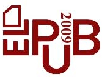

**2012-01-05. Frozen archive - links may not resolve - see directory of files at [MoinMoin wiki archive](/moinmoin-wiki-archive/)**

# > [2009DCSTworkshop](http://dublincore.org/taggingwiki/2009DCSTworkshop?action=fullsearch&value=2009DCSTworkshop&literal=1&case=1&context=40 "Click here to do a full-text search for this title")

User

 [UserPreferences](http://dublincore.org/taggingwiki/UserPreferences)
  

Site

- [FrontPage](http://dublincore.org/taggingwiki/FrontPage)
- [RecentChanges](http://dublincore.org/taggingwiki/RecentChanges)
- [FindPage](http://dublincore.org/taggingwiki/FindPage)
- [HelpContents](http://dublincore.org/taggingwiki/HelpContents)

Page

- [Edit](http://dublincore.org/taggingwiki/2009DCSTworkshop?action=edit "Edit")
- [View](http://dublincore.org/taggingwiki/2009DCSTworkshop "View")
- [Diffs](http://dublincore.org/taggingwiki/2009DCSTworkshop?action=diff "Diffs")
- [Info](http://dublincore.org/taggingwiki/2009DCSTworkshop?action=info "Info")
- [Subscribe](http://dublincore.org/taggingwiki/2009DCSTworkshop?action=subscribe "Subscribe")
- [Raw](http://dublincore.org/taggingwiki/2009DCSTworkshop?action=raw "Raw")
- [Print](http://dublincore.org/taggingwiki/2009DCSTworkshop?action=print "Print")

Actions

- [AttachFile](http://dublincore.org/taggingwiki/2009DCSTworkshop?action=AttachFile)
- [DSP2XML](http://dublincore.org/taggingwiki/2009DCSTworkshop?action=DSP2XML)
- [DeletePage](http://dublincore.org/taggingwiki/2009DCSTworkshop?action=DeletePage)
- [LikePages](http://dublincore.org/taggingwiki/2009DCSTworkshop?action=LikePages)
- [LocalSiteMap](http://dublincore.org/taggingwiki/2009DCSTworkshop?action=LocalSiteMap)
- [SpellCheck](http://dublincore.org/taggingwiki/2009DCSTworkshop?action=SpellCheck)

Search

<form method="POST" action="/taggingwiki/2009DCSTworkshop">

<input name="action" value="inlinesearch" type="hidden">
<input name="context" value="40" type="hidden">
Title: <input name="text_title" size="15" maxlength="50" type="text"><input src="2009DCSTworkshop_files/moin-search.png" name="button_title" alt="[?]" type="image"> Text: <input name="text_full" size="15" maxlength="50" type="text"><input src="2009DCSTworkshop_files/moin-search.png" name="button_full" alt="[?]" type="image">

</form>

## DC Social Tagging Workshop
 

At [http://www.elpub.net](http://www.elpub.net/)

Wednesday, 10th June 2009 (10:00 to 17:30) Università di Milano, Palazzo Greppi, Via S. Antonio 10, Milano. Sala Napoleonica

### Description

The so-called Web 2.0 brought a new breadth to the Internet, and a social perspective that seems set to stay. Services such as LinkedIn, Hi5, and Facebook have found a place in our society. People connect to each other through common paths. Meta-APIs such as Google's November 2007 release, OpenSocial, enable social applications to operate across multiple sites and services, providing a way to relate much of this data. In social bookmarking tools (e.g. Delicious, Connotea, Bibsonomy), and media sharing services (such as Youtube, Flickr, Picasa, Slideshare) people are asked to tag and otherwise annotate and share their resources inside communities or at a global scale, creating a huge amount of user generated metadata (tags) with a clear value for information discovery.

This workshop intends to gather all interested in such applications and developments, and in their relationship with metadata and practices. The themes of the workshop will be:

- Emerging trends in social tagging;

- Tagging communities and Web-based collaboration;

- Web standards for resource description in collaborative landscapes;

- Vocabulary building from folksonomies (tag-ontologies, tag-thesaurus, etc.);

- Metadata and annotation management;

- Formats for describing communities (FOAF, SIOC, etc.);

- Analysis of online communities (SNA) through folksonomies and tagging systems;

- Other ways of describing information for Web 2.0 (microformats, etc.).

### Format

The workshop will include invited talks and presentations, giving a consistent background for discussion. This will be followed by short presentations or position papers submitted by interested researchers, bloggers, etc. that will be evaluated by the Program Committee (see below).

A discussion on improving communication between (and thus research within) different user-generated metadata communities will be included. This last session in the workshop will be conducted ‘BridgeCamp’ style.

_(BridgeCamp grew from the Barcamp movement, in which participants in the workshop are offered an essentially unfilled timetable in which to either propose questions, offer to give a 5-10 minute presentation answering them, with a further 10-5 minutes for discussion.)_

### Detailed Outline

**10:00 - 10:45 - Introduction** Workshop goals, methodology, and desired outcomes. Brief overview of Social Tagging: State-of-the-Art and DC Social Tagging Community

**10:45 – 12:30 - Invited presentations** A series of invited presenters will communicate their research and positions regarding social metadata creation in different contexts, including cultural heritage, education, and general Web 2.0 services.

**12:30-14:00 - Lunch**  **14:00 – 15:30 - Short presentations** The accepted short presentations will be divided by topics in order to promote discussion.

**16:00- 17:30 - Discussion on improving communication in social tagging community**

- 16:00- 16:45 - ‘BridgeCamp’ session

- 16:45- 17:30 - 3 minute presentations from the groups, and final discussion on improving communication and research in Social tagging

### Programme Committee

- [Dan Brickley](http://www.w3.org/People/DanBri/), FOAF project, United Kingdom.

- [Pete Johnston](http://www.eduserv.org.uk/research/people/petejohnston/), Eduserv Foundation, United Kingdom.

- [Jane Greenberg](http://ils.unc.edu/%7Ejaneg/), Francis Carroll [McColl](http://dublincore.org/taggingwiki/McColl) Term Professor. University of North Carolina at Chapel Hill. USA.

- [Charles McCathieNevile](http://my.opera.com/chaals/about/), Opera Software, Norway.

- Liddy Nevile, Department of Computer Science & Computer Engineering, La Trobe University, Australia.

- [Emma Tonkin](http://www.ukoln.ac.uk/ukoln/staff/e.tonkin/), UKOLN, University of Bath, United Kingdom.

### Organizers

- [Eva Méndez](http://www.bib.uc3m.es/%7Emendez/home.htm), Associate Professor. Librarianship and Information Science Department. University Carlos III of Madrid, Spain. [emendez@bib.uc3m.es.](mailto:emendez@bib.uc3m.es.)

- [Ana Alice Baptista](http://www.ukoln.ac.uk/ukoln/staff/e.tonkin/), Auxilary Professor. Information Systems Department, School of Engineering. University of Minho, Portugal. [analice@dsi.uminho.pt.](mailto:analice@dsi.uminho.pt.)

Dr. Méndez and Dr. Baptista co-chair the [Dublin Core Social Tagging Community](http://www.dublincore.org/groups/social-tagging/) since September 2008.

 [RefreshCache](http://dublincore.org/taggingwiki/2009DCSTworkshop?action=refresh&arena=Page.py&key=2009DCSTworkshop.text_html) for this page (cached 2012-12-22 22:05:45)  

Immutable page (last edited 2009-05-15 15:38:26 by AnaBaptista)

