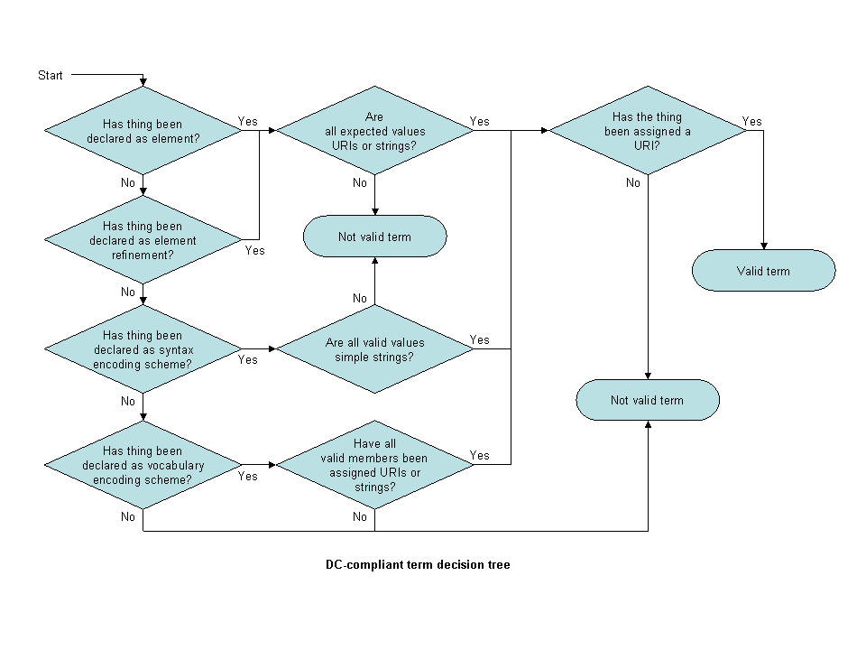

**2012-01-05. Frozen archive - links may not resolve - see directory of files at [MoinMoin wiki archive](/moinmoin-wiki-archive/)**

# > [TermDecisionTree](http://dublincore.org/architecturewiki/TermDecisionTree?action=fullsearch&value=TermDecisionTree&literal=1&case=1&context=40 "Click here to do a full-text search for this title")

User

 [UserPreferences](http://dublincore.org/architecturewiki/UserPreferences)
  

Site

- [FrontPage](http://dublincore.org/architecturewiki/FrontPage)
- [RecentChanges](http://dublincore.org/architecturewiki/RecentChanges)
- [FindPage](http://dublincore.org/architecturewiki/FindPage)
- [HelpContents](http://dublincore.org/architecturewiki/HelpContents)

Page

- [Edit](http://dublincore.org/architecturewiki/TermDecisionTree?action=edit "Edit")
- [View](http://dublincore.org/architecturewiki/TermDecisionTree "View")
- [Diffs](http://dublincore.org/architecturewiki/TermDecisionTree?action=diff "Diffs")
- [Info](http://dublincore.org/architecturewiki/TermDecisionTree?action=info "Info")
- [Subscribe](http://dublincore.org/architecturewiki/TermDecisionTree?action=subscribe "Subscribe")
- [Raw](http://dublincore.org/architecturewiki/TermDecisionTree?action=raw "Raw")
- [Print](http://dublincore.org/architecturewiki/TermDecisionTree?action=print "Print")

Actions

- [AttachFile](http://dublincore.org/architecturewiki/TermDecisionTree?action=AttachFile)
- [DSP2XML](http://dublincore.org/architecturewiki/TermDecisionTree?action=DSP2XML)
- [DeletePage](http://dublincore.org/architecturewiki/TermDecisionTree?action=DeletePage)
- [LikePages](http://dublincore.org/architecturewiki/TermDecisionTree?action=LikePages)
- [LocalSiteMap](http://dublincore.org/architecturewiki/TermDecisionTree?action=LocalSiteMap)
- [SpellCheck](http://dublincore.org/architecturewiki/TermDecisionTree?action=SpellCheck)

Search

<form method="POST" action="/architecturewiki/TermDecisionTree">

<input name="action" value="inlinesearch" type="hidden">
<input name="context" value="40" type="hidden">
Title: <input name="text_title" size="15" maxlength="50" type="text"><input src="TermDecisionTree_files/moin-search.png" name="button_title" alt="[?]" type="image"> Text: <input name="text_full" size="15" maxlength="50" type="text"><input src="TermDecisionTree_files/moin-search.png" name="button_full" alt="[?]" type="image">

</form>

--- Note 2007-12-13: This version is being frozen - editing continues at [http://dublincore.org/usageboardwiki/TermDecisionTree](http://dublincore.org/usageboardwiki/TermDecisionTree).

---

## DCMI-compliant 'term' decision tree

[AndyPowell](http://dublincore.org/architecturewiki/AndyPowell)  
 Eduserv Foundation  
 December 2005

This document is currently under development. It is being worked on by the [DC RDF Taskforce](http://dublincore.org/architecturewiki/DCRDFTaskforce "Self"). Comments should be sent to the [dc-rdf-taskforce@jiscmail.ac.uk](http://www.jiscmail.ac.uk/lists/DC-RDF-TASKFORCE.html) mailing list.

### Introduction

This decision tree can be used to see if something is a DCMI-compliant element, element refinement or encoding scheme, where "DCMI-compliant" means conformant with the DCMI Abstract Model and therefore suitable for use in DC metadata descriptions.

Note that in the following text, the italicised terms are defined in the terminology section below.

### Decision tree

1. 

Has the thing been explicitly declared as a DCMI _element_ (i.e. as an RDF _property_)?

 The declaration should take the form of a human-readable statement, e.g. <pre> X is a DCMI 'element'
      </pre> or <pre> X is an RDF property.
      </pre> and a machine-readable RDFS declaration <pre> &lt;rdf:Property rdf:about="http://example.org/term/X"&gt;
        ...
      &lt;/rdf:Property&gt;
      </pre> **If 'yes', go to question 2.** Otherwise, go to question 3. - Have the expected _values_ of the _element_ been assigned _value URIs_ or can they be represented using simple _value strings_ (plain text strings)?

 **If 'yes', go to question 9.** Otherwise, go to question 3. - Has the thing been explicitly declared as a DCMI _element refinement_ (i.e. as an RDF _property_)?

 The declaration should take the form of a human-readable statement, e.g. <pre> X is a DCMI 'element refinement'.
      </pre> or <pre> X is an RDF property.
      </pre> and a machine-readable RDFS declaration <pre> &lt;rdf:Property rdf:about="http://example.org/term/X"&gt;
        ...
      &lt;/rdf:Property&gt;
      </pre> **If 'yes', go to question 4.** Otherwise, go to question 5. - Have the expected _values_ of the _element refinement_ been assigned _value URIs_ or can they be represented using simple _value strings_ (plain text strings)?

 **If 'yes', go to question 9.** Otherwise, go to question 5. - Has the thing been explicitly declared as a DCMI _syntax encoding scheme_?

 The declaration should take the form of a human-readable statement, e.g. <pre> X is a DCMI 'syntax encoding scheme'.
      </pre> or <pre> X is an RDF datatype.
      </pre> and a machine-readable RDFS declaration <pre> &lt;rdfs:Datatype rdf:about="http://example.org/term/X"&gt;
        ...
      &lt;/rdfs:Datatype&gt;
      </pre> **If 'yes', go to question 6.** Otherwise, go to question 7. - Are all the valid constructs according to the _syntax encoding scheme_ simple _value strings_ (plain text strings)?

 **If 'yes', go to question 9.** Otherwise, go to question 7. - Has the thing been explicitly declared as a DCMI _vocabulary encoding scheme_?

 The declaration should take the form of a human-readable statement, e.g. <pre> X is a DCMI 'vocabulary encoding scheme'.
      </pre> or <pre> X is an RDF class.
      </pre> and a machine-readable RDFS declaration <pre> &lt;rdfs:Class rdf:about="http://example.org/term/X"&gt;
        ...
      &lt;/rdfs:Class&gt;
      </pre> **If 'yes', go to question 9.** Otherwise, the thing is not a valid DCMI _element_, _element refinement_ or _encoding scheme_. - Have all the valid members of the _vocabulary encoding scheme_ _resources_ been assigned _value URIs_ or can they be represented using simple _value strings_ (plain text strings)?

 **If 'yes', go to question 9.** Otherwise, the thing is not a valid DCMI _element_, _element refinement_ or _encoding scheme_. - Has the thing been assigned a URI (a _property URI_ or an _encoding scheme URI_)?

 For example: [http://example.org/term/X](http://example.org/term/X) . Dereferencing the URI should result in an HTTP 303 redirect to HTML (text/html) and RDF (application/rdf+xml) representations of the _term_. HTTP content negotiation should be used to select one or other representation. **If 'yes', the thing is a valid DCMI _element_, _element refinement_ or _encoding scheme_.** Otherwise, the thing is not a valid DCMI _element_, _element refinement_ or _encoding scheme_. 

### Notes

Best practice for serving representations of metadata terms using HTTP is still emerging. DCMI suggests the approach recommended above. Further, DCMI suggests serving an RDF declaration for each term that includes enough contextual information to interpret the term in the context of related terms. For example, it may be sensible to serve an RDF declaration for all the terms in a given namespace as the representation of each of the individual terms within that namespace.

New _terms_ that are proposed during the creation of an application profile may be temporarily assigned _term URIs_ using the <tt>example.org</tt> domain name, pending the assignment of a proper _term URI_ by the DCMI Usage Board. In this case, the criteria concerning dereferencing the URI to obtain a human-readbale or machine-reable representation of the _term_ do not apply.

The diagram above is also available as a [MS-Powerpoint file](http://dublincore.org/architecturewiki/TermDecisionTree?action=AttachFile&do=get&target=dc-term-decision-tree.ppt).

### Terminology
<dl>

    <dt> ''class''</dt>
<dd>

A group containing members that have attributes, behaviours, relationships or semantics in common; a kind of category. 

</dd>
    <dt> ''class URI''</dt>
<dd>

A URI that identifies a <em>class</em>. 

</dd>
    <dt> ''element''</dt>
<dd>

A <em>property</em> of a <em>resource</em>. 

</dd>
    <dt> ''element refinement''</dt>
<dd>

A <em>property</em> of a <em>resource</em> that shares the meaning of a particular DCMI <em>property</em> but with narrower semantics. Since <em>element refinements</em> are <em>properties</em>, they can be used in metadata descriptions independently of the <em>properties</em> they refine. 

</dd>
    <dt> ''encoding scheme''</dt>
<dd>

A <em>vocabulary encoding scheme</em> or a <em>syntax encoding scheme</em>. 

</dd>
    <dt> ''encoding scheme URI''</dt>
<dd>

A <em>vocabulary encoding scheme URI</em> or a <em>syntax encoding scheme URI</em>. 

</dd>
    <dt> ''property''</dt>
<dd>

A specific aspect, characteristic, attribute, or relation used to describe resources. 

</dd>
    <dt> ''property URI''</dt>
<dd>

A URI that identifies a single <em>property</em>. 

</dd>
    <dt> ''syntax encoding scheme''</dt>
<dd>

An indication that the <em>value string</em> is formatted in accordance with a formal notation, such as "2000-01-01" as the standard expression of a date. 

</dd>
    <dt> ''syntax encoding scheme URI''</dt>
<dd>

A URI that identifies a <em>syntax encoding scheme</em>. 

</dd>
    <dt> ''term''</dt>
<dd>

A <em>property</em> (i.e. <em>element</em> or <em>element refinement</em>), <em>vocabulary encoding scheme</em>, <em>syntax encoding scheme</em> or concept taken from a controlled vocabulary (concept space). 

</dd>
    <dt> ''term URI''</dt>
<dd>

A URI that identifies a <em>term</em>. 

</dd>
    <dt> ''vocabulary encoding scheme''</dt>
<dd>

A <em>class</em> that indicates that the <em>value</em> of a <em>property</em> is taken from a controlled vocabulary (or concept-space), such as the Library of Congress Subject Headings. 

</dd>
    <dt> ''vocabulary encoding scheme URI''</dt>
<dd>

A URI that identifies a <em>vocabulary encoding scheme</em>.  

</dd>
</dl>

 [RefreshCache](http://dublincore.org/architecturewiki/TermDecisionTree?action=refresh&arena=Page.py&key=TermDecisionTree.text_html) for this page (cached 2012-12-21 19:48:21)  

Immutable page (last edited 2007-12-13 08:52:33 by TomBaker)

