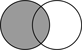

**2012-01-05. Frozen archive - links may not resolve - see directory of files at [MoinMoin wiki archive](/moinmoin-wiki-archive/)**

# > [Correlation Resource](http://dublincore.org/educationwiki/Correlation_20Resource?action=fullsearch&value=Correlation+Resource&literal=1&case=1&context=40 "Click here to do a full-text search for this title")

User

 [UserPreferences](http://dublincore.org/educationwiki/UserPreferences)
  

Site

- [FrontPage](http://dublincore.org/educationwiki/FrontPage)
- [RecentChanges](http://dublincore.org/educationwiki/RecentChanges)
- [FindPage](http://dublincore.org/educationwiki/FindPage)
- [HelpContents](http://dublincore.org/educationwiki/HelpContents)

Page

- [Edit](http://dublincore.org/educationwiki/Correlation_20Resource?action=edit "Edit")
- [View](http://dublincore.org/educationwiki/Correlation_20Resource "View")
- [Diffs](http://dublincore.org/educationwiki/Correlation_20Resource?action=diff "Diffs")
- [Info](http://dublincore.org/educationwiki/Correlation_20Resource?action=info "Info")
- [Subscribe](http://dublincore.org/educationwiki/Correlation_20Resource?action=subscribe "Subscribe")
- [Raw](http://dublincore.org/educationwiki/Correlation_20Resource?action=raw "Raw")
- [Print](http://dublincore.org/educationwiki/Correlation_20Resource?action=print "Print")

Actions

- [AttachFile](http://dublincore.org/educationwiki/Correlation_20Resource?action=AttachFile)
- [DSP2XML](http://dublincore.org/educationwiki/Correlation_20Resource?action=DSP2XML)
- [DeletePage](http://dublincore.org/educationwiki/Correlation_20Resource?action=DeletePage)
- [LikePages](http://dublincore.org/educationwiki/Correlation_20Resource?action=LikePages)
- [LocalSiteMap](http://dublincore.org/educationwiki/Correlation_20Resource?action=LocalSiteMap)
- [SpellCheck](http://dublincore.org/educationwiki/Correlation_20Resource?action=SpellCheck)

Search

<form method="POST" action="/educationwiki/Correlation_20Resource">

<input name="action" value="inlinesearch" type="hidden">
<input name="context" value="40" type="hidden">
Title: <input name="text_title" size="15" maxlength="50" type="text"><input src="Correlation_20Resource_files/moin-search.png" name="button_title" alt="[?]" type="image"> Text: <input name="text_full" size="15" maxlength="50" type="text"><input src="Correlation_20Resource_files/moin-search.png" name="button_full" alt="[?]" type="image">

</form>

 [Return to Wiki Version](http://dublincore.org/educationwiki/WikiVersion) 
## Correlation Resource

The use of the <tt>conformsTo</tt> property assumes that the learning objectives of the learning resource are coextensive with those of the achievement standard to which that learning resource is being correlated. With the exception of learning resources designed specifically to address the learning objectives defined by a particular, formally promulgated achievement standard, the correlation between learning resource and an learning objective will usually be less than perfect. Use of a separate _correlation resource_ makes it possible to make statements about the "strength of fit" of the correlation (as well as about other characteristics of the mapping of learning resource to learning outcome).

- Core characteristics of a _correlation resource_

  - ***Learning objective:*** Reference to an achievement standard to which the educational resource correlates.

  - ***Learning resource:*** Reference to the educational resource to which the achievement standard correlates.

  - ***Correlation Factor:*** The degree of fit between the educational resource and the achievement standard to which that educational resource is being correlated.

  - ***Authority:*** An entity primarily responsible for making the correlation resource.

  - ***Method of creation:*** Identification of the means by which the correlation was created--e.g., human, machine-derived, hybrid (human & machine).

  - ***Description:*** Discussion of the analytic methods used in making the correlation.

The _Correlation Resource_ is necessary to meet a number of needs of teachers searching for learning resources. In daily practice, teachers use correlations of resources to standards for two separate, but related tasks:

- _Information Search and Retrieval_. Consistently represented learning outcomes can enhance information retrieval recall and precision by allowing a teacher to retrieve all and only resources addressing a specific learning outcome. Information about the learning objectives of a resource is frequently as important as its subject, and, on occasion, even more important. It is axiomatic that all teaching and learning activities include either explicit or implicit higher-level learning objectives that find expression in the promulgated achievement standards. Having the ability to target learning resources based on those outcomes can optimize limited teacher time spent searching. In addition, cross-mappings among similar outcomes in different jurisdictions enabled by unique identification and representation of achievement standards makes it possible to expand searches to discover resources correlated to similar standards in other jurisdictions.

- _Resource Compliance_. The political imperative for accountability in primary and secondary education means that teachers not only use the correlations for the general purposes of search and retrieval, but also to help them be accountable in their responsibilities to the children in their classrooms, the children’s parents, the school, district and the nation. As a result, this task is permeated with issues of trust and levels of teacher confidence in the quality of a correlation. Research confirms that where the “consequences of use of information” or the “act or commitment based on information” are considered significant by the information seeker, they exercise heightened scrutiny in making information quality judgments. An information seeker’s trust is gained only when he or she sees the creator of the information as a “cognitive authority.” Thus, cognitive authority is concerned with how people trust one another’s opinions and is a conditional state of credibility bestowed by a trusting individual on someone or an agency. In essence, cognitive authority is rooted in identity and reputation and is concerned about “who knows what about what.” Thus, being able to identify the creator of the correlation and his or her affiliation will be necessary to building cognitive authority and trust.

These two tasks demand different levels of accuracy and precision in the correlation. A teacher might be quite satisfied for purposes of search and retrieval with correlations that manage to retrieve and to collocate resources more or less addressing an achievement standard. However, that teacher is likely to be dissatisfied with such results when looking for resources correlated with precision and authority in order to complete part of the fabric of his or her local curriculum. Thus, quality as “fitness for purpose” must be measured against both of these tasks. The _Correlation Resource_ is necessary to accommodate the more particular demands of accountability.

The enumeration of a set of core characteristics (properties) of a correlation resource does not preclude the addition of other properties deemed necessary or useful in a specific context (i.e., a correlation resource application profile).

### Properties and Controlled Vocabularies

<table width="100%">
  <tbody>
    <tr>
      <td colspan="3" align="center">
        <strong>TABLE OF PROPERTIES AND CONTROLLED VOCABULARIES</strong>
      </td>
    </tr>
    <tr>
      <td>
        <strong>Label</strong>
      </td>
      <td>
        <strong>Decription</strong>
      </td>
      <td>
        <strong>URI</strong>
      </td>
    </tr>
    <tr>
      <td colspan="3" align="center">
        <strong>Correlation Resource (and Related) Properties</strong> </td>
    </tr>
    <tr>
      <td>
        Has Correlation</td>
      <td>
        An entity that describes the correlation between a learning resource and a learning objective.</td>
      <td>
        <a href="http://purl.org/ASN/schema/core/hasCorrelation">http://purl.org/ASN/schema/core/hasCorrelation</a>
      </td>
    </tr>
    <tr>
      <td>
        Creator</td>
      <td>
        An entity primarily responsible for making the [correlation] resource.</td>
      <td>
        <a href="http://purl.org/dc/elements/1.1/creator">http://purl.org/dc/elements/1.1/creator</a>
      </td>
    </tr>
    <tr>
      <td>
        Resource URI </td>
      <td>
        The educational resource being correlated </td>
      <td>
        <a href="http://purl.org/ASN/schemas/core/resourceURI">http://purl.org/ASN/schemas/core/resourceURI</a>
      </td>
    </tr>
    <tr>
      <td>
        Conforms To </td>
      <td>
        A reference to an established standard to which the resource conforms. </td>
      <td>
        <a href="http://purl.org/dc/terms/conformsTo">http://purl.org/dc/terms/conformsTo</a> </td>
    </tr>
    <tr>
      <td>
        Correlation Method </td>
      <td>
        The method used to generate the correlation. ['human,' 'machine-derived,' 'hybrid'] </td>
      <td>
        <a href="http://purl.org/ASN/schema/core/correlationMethod">http://purl.org/ASN/schema/core/correlationMethod</a> </td>
    </tr>
    <tr>
      <td>
        Correlation Factor </td>
      <td>
        The strength of fit among concepts of interest in the learning resource
        and the standard. ['major," 'minor,' 'broad,' 'narrow'] </td>
      <td>
        <a href="http://purl.org/ASN/schema/core/correlationFactor">http://purl.org/ASN/schema/core/correlationFactor</a> </td>
    </tr>
    <tr>
      <td>
        Description </td>
      <td>
        An account of the correlation principles used to generate the resource. </td>
      <td>
        <a href="http://purl.org/dc/elements/1.1/description">http://purl.org/dc/elements/1.1/description</a> </td>
    </tr>
    <tr>
      <td colspan="3" align="center">
        <strong>Correlation Factor Controlled Vocabulary</strong>
      </td>
    </tr>
    <tr>
      <td>
        Major Correlation -- 
      </td>
      <td>
        Major overlap of concepts of interest between the educational resource and the achievement standard.</td>
      <td>
        -- </td>
    </tr>
    <tr>
      <td>
        Minor Correlation -- 
      </td>
      <td>
        Minor overlap of concepts of interest between the educational resource and the achievement standard.</td>
      <td>
        -- </td>
    </tr>
    <tr>
      <td>
        Broad Correlation -- 
      </td>
      <td>
        The standard covers all of the concepts of interest in the educational 
        resource as well as concepts of interest not found in the educational 
        resource.</td>
      <td>
        -- </td>
    </tr>
    <tr>
      <td>
        Narrow Correlation -- 
      </td>
      <td>
        The educational resource covers all of the concepts of interest in the 
        standard as well as concepts of interest not found in the achievement 
        standard.</td>
      <td>
        --</td>
    </tr>
    <tr>
      <td>
        Exact Correlation -- 
      </td>
      <td>
        The concepts of interest in the educational resource and the standard statement are co-exstensive.</td>
      <td>
        --</td>
    </tr>
    <tr>
      <td colspan="3" align="center">
        <strong>Method of Correlation Controlled Vocabulary</strong>
      </td>
    </tr>
    <tr>
      <td>
        Human</td>
      <td>
        A correlation created by a human.</td>
      <td>
        <a href="http://purl.org/ASN/scheme/ASNCorrelationMethod/Human">http://purl.org/ASN/scheme/ASNCorrelationMethod/Human</a>
      </td>
    </tr>
    <tr>
      <td>
        Machine Derived</td>
      <td>
        A correlation created by a machine (e.g., natural language processing).</td>
      <td>
        <a href="http://purl.org/ASN/scheme/ASNCorrelationMethod/MachineDerived">http://purl.org/ASN/scheme/ASNCorrelationMethod/MachineDerived</a>
      </td>
    </tr>
    <tr>
      <td>
        Hybrid</td>
      <td>
        A correlation created through machine/human interaction (e.g., an automated "suggester" system).</td>
      <td>
        <a href="http://purl.org/ASN/scheme/ASNCorrelationMethod/Hybrid">http://purl.org/ASN/scheme/ASNCorrelationMethod/Hybrid</a>
      </td>
    </tr>
  </tbody>
</table>

## Example
<pre>&lt;?xml version="1.0" encoding="UTF-8"?&gt; 
    &lt;dcxf:descriptionSet xmlns:dcxf="http://dublincore.org/xml/dc-xml-full/2007/06/19"&gt;

        &lt;!--BEGIN DESCRIPTION OF EDUCATIONAL RESOURCE --&gt;
        &lt;dcxf:description dcxf:resourceURI="http://whyfiles.org/107flood/index.html"&gt;

        &lt;dcxf:statement dcxf:propertyURI="http://purl.org/dc/elements/1.1/title"&gt;
             &lt;dcxf:literalValueString xml:lang="en-US"&gt;Flood of Evidence&lt;/dcxf:literalValueString&gt;
        &lt;/dcxf:statement&gt;
 
        ...

        &lt;dcxf:statement dcxf:propertyURI="http://purl.org/dc/terms/conformsTo" 
             dcxf:valueURI="http://purl.org/ASN/resources/S100AB7D" /&gt; 
        &lt;dcxf:statement dcxf:propertyURI="http://purl.org/ASN/schema/core/hasCorrelation" 
             dcxf:valueRef="correlation" /&gt; 
               
        &lt;/dcxf:description&gt;
        &lt;!-- END DESCRIPTION OF THE EDUCATIONAL RESOURCE --&gt;
  
  
        &lt;!-- BEGIN RELATED DESCRIPTION OF STANDARD CORRELATION --&gt;
        &lt;dcxf:description dcxf:resourceID="correlation"&gt;
    
        &lt;dcxf:statement dcxf:propertyURI="http://purl.org/ASN/schema/core/resourceURI" 
             dcfx:valueURI="http://example.org/volcanic_properties.html" /&gt;

        &lt;dcxf:statement dcxf:propertyURI="http://purl.org/dc/elements/1.1/creator" 
             dcfx:valueURI="http://example.org/agents/JBillings"&gt;
             &lt;dcxf:valueString&gt;James Billings&lt;/dcxf:valueString&gt;
        &lt;/dcxf:statement&gt;

        &lt;dcxf:statement dcxf:propertyURI="http://purl.org/dc/terms/conformsTo" 
             dcxf:valueURI="http://purl.org/ASN/resources/S101582F" /&gt;        

        &lt;dcxf:statement dcxf:propertyURI="http://purl.org/ASN/schema/core/correlationFactor" 
             dcxf:valueURI="http://purl.org/ASN/scheme/CorrelationFactor/MajorCorrelation" /&gt;

        &lt;dcxf:statement dcxf:propertyURI="http://purl.org/ASN/schema/core/correlationMethod" 
             dcxf:valueURI="http://purl.org/ASN/scheme/ASNCorrelationMethod/Human"&gt; 
             &lt;dcxf:valueString&gt;Human&lt;/dcxf:valueString&gt;
        &lt;/dcxf:statement&gt;

        &lt;dcxf:statement dcxf:propertyURI="http://purl.org/dc/terms/description"&gt;
             &lt;dcxf:literalValueString xml:lang="en-US"&gt;This correlation was originally derived 
             by machine with human evaluation of the result.&lt;/dcxf:literalValueString&gt;
        &lt;/dcxf:statement&gt;      
        
      &lt;/dcxf:description&gt;
    &lt;/dcxf:descriptionSet&gt; </pre>
 [Return to Wiki Version](http://dublincore.org/educationwiki/WikiVersion) 

 [RefreshCache](http://dublincore.org/educationwiki/Correlation_20Resource?action=refresh&arena=Page.py&key=Correlation_20Resource.text_html) for this page (cached 2013-01-04 10:22:06)  

Immutable page (last edited 2011-04-12 14:15:22 by StuartSutton)

