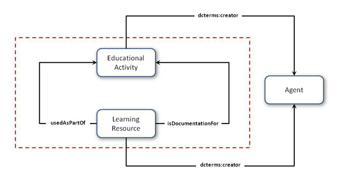
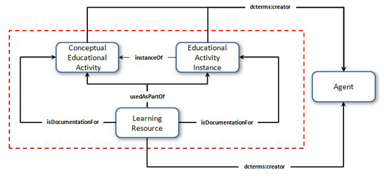
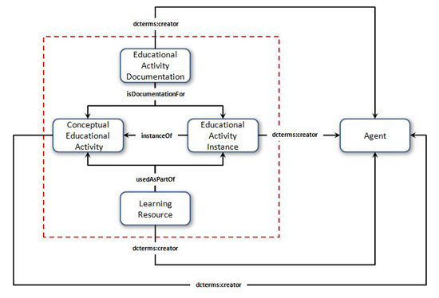
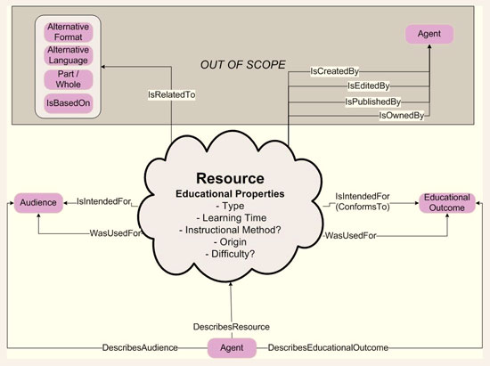

**2012-01-05. Frozen archive - links may not resolve - see directory of files at [MoinMoin wiki archive](/moinmoin-wiki-archive/)**

# > [Model](http://dublincore.org/educationwiki/Model?action=fullsearch&value=Model&literal=1&case=1&context=40 "Click here to do a full-text search for this title")

User

 [UserPreferences](http://dublincore.org/educationwiki/UserPreferences)
  

Site

- [FrontPage](http://dublincore.org/educationwiki/FrontPage)
- [RecentChanges](http://dublincore.org/educationwiki/RecentChanges)
- [FindPage](http://dublincore.org/educationwiki/FindPage)
- [HelpContents](http://dublincore.org/educationwiki/HelpContents)

Page

- [Edit](http://dublincore.org/educationwiki/Model?action=edit "Edit")
- [View](http://dublincore.org/educationwiki/Model "View")
- [Diffs](http://dublincore.org/educationwiki/Model?action=diff "Diffs")
- [Info](http://dublincore.org/educationwiki/Model?action=info "Info")
- [Subscribe](http://dublincore.org/educationwiki/Model?action=subscribe "Subscribe")
- [Raw](http://dublincore.org/educationwiki/Model?action=raw "Raw")
- [Print](http://dublincore.org/educationwiki/Model?action=print "Print")

Actions

- [AttachFile](http://dublincore.org/educationwiki/Model?action=AttachFile)
- [DSP2XML](http://dublincore.org/educationwiki/Model?action=DSP2XML)
- [DeletePage](http://dublincore.org/educationwiki/Model?action=DeletePage)
- [LikePages](http://dublincore.org/educationwiki/Model?action=LikePages)
- [LocalSiteMap](http://dublincore.org/educationwiki/Model?action=LocalSiteMap)
- [SpellCheck](http://dublincore.org/educationwiki/Model?action=SpellCheck)

Search

<form method="POST" action="/educationwiki/Model">

<input name="action" value="inlinesearch" type="hidden">
<input name="context" value="40" type="hidden">
Title: <input name="text_title" size="15" maxlength="50" type="text"><input src="Model_files/moin-search.png" name="button_title" alt="[?]" type="image"> Text: <input name="text_full" size="15" maxlength="50" type="text"><input src="Model_files/moin-search.png" name="button_full" alt="[?]" type="image">

</form>

### MODELS IN REVERSE CHRONOLOGICAL ORDER

#### Ver.3c

**The Model:**

**Entity Definitions:**

<table>
  <tbody>
    <tr>
      <td>
        <strong>ENTITY</strong>
      </td>
      <td>
        <strong>DEFINITION</strong>
      </td>
      <td>
        <strong>DISCUSSION SUMMARY</strong>
      </td>
    </tr>
    <tr>
      <td>
        <strong><a class="nonexistent" href="http://dublincore.org/educationwiki/EducationalActivity">EducationalActivity</a></strong>
      </td>
      <td>
        The idea for, or an instantiation of, an educational activity (e.g. the 
        idea of teaching fractions by dividing a jar of sweets into a fixed 
        number of bags or the lesson given by a particular teacher, in a 
        particular school, at a particular time).</td>
      <td>
        -- </td>
    </tr>
    <tr>
      <td>
        <strong><a class="nonexistent" href="http://dublincore.org/educationwiki/LearningResource">LearningResource</a></strong>
      </td>
      <td>
        Any Resource that is used as part of an <a class="nonexistent" href="http://dublincore.org/educationwiki/EducationalActivity">EducationalActivity</a> (e.g. a textbook) or that describes (e.g. a lesson plan) or records (e.g. an audio- or video-recording of a lesson) the same.</td>
      <td>
        -- </td>
    </tr>
  </tbody>
</table>

#### Ver.3b

**The Model:**

**Entity Definitions:**

**(With the exception of [LearningResource](http://dublincore.org/educationwiki/LearningResource), all definitions are the same as Ver.3a below)**

<table>
  <tbody>
    <tr>
      <td>
        <strong>ENTITY</strong>
      </td>
      <td>
        <strong>DEFINITION</strong>
      </td>
      <td>
        <strong>DISCUSSION SUMMARY</strong>
      </td>
    </tr>
    <tr>
      <td>
        <strong><a class="nonexistent" href="http://dublincore.org/educationwiki/ConceptualEducationalActivity">ConceptualEducationalActivity</a></strong>
      </td>
      <td>
        The idea for an educational activity (e.g. the idea of teaching 
        fractions by dividing a jar of sweets into a fixed number of bags). </td>
      <td>
        -- </td>
    </tr>
    <tr>
      <td>
        <strong><a class="nonexistent" href="http://dublincore.org/educationwiki/EducationalActivityInstance">EducationalActivityInstance</a></strong>
      </td>
      <td>
        The instantiation of a <a class="nonexistent" href="http://dublincore.org/educationwiki/ConceptualEducationalActivity">ConceptualEducationalActivity</a>
        as an event that can be experienced by one or more participants (e.g. a
        lesson given by a particular teacher, in a particular school, at a 
        particular time).</td>
      <td>
        -- </td>
    </tr>
    <tr>
      <td>
        <strong><a class="nonexistent" href="http://dublincore.org/educationwiki/LearningResource">LearningResource</a></strong>
      </td>
      <td>
        Any Resource that is used as part of a <a class="nonexistent" href="http://dublincore.org/educationwiki/ConceptualEducationalActivity">ConceptualEducationalActivity</a> or an <a class="nonexistent" href="http://dublincore.org/educationwiki/EducationalActivityInstance">EducationalActivityInstance</a> (e.g. a textbook) or that describes (e.g. a lesson plan) or records (e.g. an audio- or video-recording of a lesson) the same.</td>
      <td>
        -- </td>
    </tr>
  </tbody>
</table>

#### Ver.3a

**The Model:**

**Entity Definitions:**

<table>
  <tbody>
    <tr>
      <td>
        <strong>ENTITY</strong>
      </td>
      <td>
        <strong>DEFINITION</strong>
      </td>
      <td>
        <strong>DISCUSSION SUMMARY</strong>
      </td>
    </tr>
    <tr>
      <td>
        <strong><a class="nonexistent" href="http://dublincore.org/educationwiki/ConceptualEducationalActivity">ConceptualEducationalActivity</a></strong>
      </td>
      <td>
        The idea for an educational activity (e.g. the idea of teaching 
        fractions by dividing a jar of sweets into a fixed number of bags).</td>
      <td>
        -- </td>
    </tr>
    <tr>
      <td>
        <strong><a class="nonexistent" href="http://dublincore.org/educationwiki/EducationalActivityInstance">EducationalActivityInstance</a></strong>
      </td>
      <td>
        The instantiation of a <a class="nonexistent" href="http://dublincore.org/educationwiki/ConceptualEducationalActivity">ConceptualEducationalActivity</a>
        as an event that can be experienced by one or more participants (e.g. a
        lesson given by a particular teacher, in a particular school, at a 
        particular time).</td>
      <td>
        -- </td>
    </tr>
    <tr>
      <td>
        <strong><a class="nonexistent" href="http://dublincore.org/educationwiki/EducationalActivityDocumentation">EducationalActivityDocumentation</a></strong>
      </td>
      <td>
        Any resource that describes (e.g. a lesson plan) or records (e.g. an audio- or video recording of a lesson) a <a class="nonexistent" href="http://dublincore.org/educationwiki/ConceptualEducationalActivity">ConceptualEducationalActivity</a> or an <a class="nonexistent" href="http://dublincore.org/educationwiki/EducationalActivityInstance">EducationalActivityInstance</a>.</td>
      <td>
        -- </td>
    </tr>
    <tr>
      <td>
        <strong><a class="nonexistent" href="http://dublincore.org/educationwiki/LearningResource">LearningResource</a></strong>
      </td>
      <td>
        Any Resource that is used as part of a <a class="nonexistent" href="http://dublincore.org/educationwiki/ConceptualEducationalActivity">ConceptualEducationalActivity</a> or an <a class="nonexistent" href="http://dublincore.org/educationwiki/EducationalActivityInstance">EducationalActivityInstance</a> (e.g. a textbook) the same.</td>
      <td>
        -- </td>
    </tr>
  </tbody>
</table>

#### Ver.3

The yellow area [of version 3] represents "all resources that describe or prescribe an idea for an educational activity or the instantiation of that idea into educational practice together with any other resources that are used as part of those educational activities."

#### Ver.2a

#### Ver.2

#### Ver.1a

#### Ver.1

 [RefreshCache](http://dublincore.org/educationwiki/Model?action=refresh&arena=Page.py&key=Model.text_html) for this page (cached 2012-12-27 08:56:37)  

Immutable page (last edited 2011-04-12 14:29:25 by StuartSutton)

