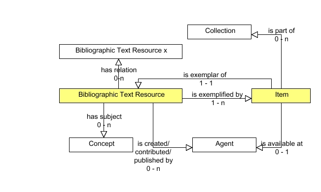

**2012-01-05. Frozen archive - links may not resolve - see directory of files at [MoinMoin wiki archive](/moinmoin-wiki-archive/)**

# > [EntityRelationshipModel](http://dublincore.org/librarieswiki/EntityRelationshipModel?action=fullsearch&value=EntityRelationshipModel&literal=1&case=1&context=40 "Click here to do a full-text search for this title")

User

 [UserPreferences](http://dublincore.org/librarieswiki/UserPreferences)
  

Site

- [FrontPage](http://dublincore.org/librarieswiki/FrontPage)
- [RecentChanges](http://dublincore.org/librarieswiki/RecentChanges)
- [FindPage](http://dublincore.org/librarieswiki/FindPage)
- [HelpContents](http://dublincore.org/librarieswiki/HelpContents)

Page

- [Edit](http://dublincore.org/librarieswiki/EntityRelationshipModel?action=edit "Edit")
- [View](http://dublincore.org/librarieswiki/EntityRelationshipModel "View")
- [Diffs](http://dublincore.org/librarieswiki/EntityRelationshipModel?action=diff "Diffs")
- [Info](http://dublincore.org/librarieswiki/EntityRelationshipModel?action=info "Info")
- [Subscribe](http://dublincore.org/librarieswiki/EntityRelationshipModel?action=subscribe "Subscribe")
- [Raw](http://dublincore.org/librarieswiki/EntityRelationshipModel?action=raw "Raw")
- [Print](http://dublincore.org/librarieswiki/EntityRelationshipModel?action=print "Print")

Actions

- [AttachFile](http://dublincore.org/librarieswiki/EntityRelationshipModel?action=AttachFile)
- [DSP2XML](http://dublincore.org/librarieswiki/EntityRelationshipModel?action=DSP2XML)
- [DeletePage](http://dublincore.org/librarieswiki/EntityRelationshipModel?action=DeletePage)
- [LikePages](http://dublincore.org/librarieswiki/EntityRelationshipModel?action=LikePages)
- [LocalSiteMap](http://dublincore.org/librarieswiki/EntityRelationshipModel?action=LocalSiteMap)
- [SpellCheck](http://dublincore.org/librarieswiki/EntityRelationshipModel?action=SpellCheck)

Search

<form method="POST" action="/librarieswiki/EntityRelationshipModel">

<input name="action" value="inlinesearch" type="hidden">
<input name="context" value="40" type="hidden">
Title: <input name="text_title" size="15" maxlength="50" type="text"><input src="EntityRelationshipModel_files/moin-search.png" name="button_title" alt="[?]" type="image"> Text: <input name="text_full" size="15" maxlength="50" type="text"><input src="EntityRelationshipModel_files/moin-search.png" name="button_full" alt="[?]" type="image">

</form>

### Entity-Relationship Model for the DC-Lib AP for Bibliographic Text Resources

According to Singapore Framework an application profile must provide a domain model which defines the basic entities described by the profile and their fundamental relationships. Basis of this model are the Functional Requirements which in our case demand simplicity and feasibility on the one hand and linked data compatibility on the other. Furthermore the Functional Requirements demand a distinction between a publication and its single copies to describe availability and accessability of items in libraries. And finally metadata should be compliant with metadata of other library applications in the long run.

For these reasons we developed a non-FRBR model, aligning on the model of the Functional Requirements of Bibliographic Records (FRBR) in some ways.

- FRBR distinguishes the following Group 1 entities: work, expression, manifestation and item. Our model distinguishes on this level only two entities: bibliographic text resource and item.

- FRBR distinguishes the following Group 2 entities: person and corporate body. Our model uses on this level only one entity: agent.

- FRBR distingiushes the followong Group 3 entities: concept, object, event und place. Our model uses on this level only one entity: concept

The entity-relationship model represents the relations between these entities:

where

- any Bibliographic Text Resource is an instance of the class bibliographicTextResource, which is a subclass of dcterms:bibliographicResource. (For further definition of bibliographicTextResource see [LibClasses](http://dublincore.org/librarieswiki/LibClasses)) A Bibliographic Text Resource   
 - has to be exemplified by one or more items   
 - has to be created, contributed or published by one or more Agents   
 - may have one or more Concepts as a subject   
 - may have relations to one or more other Bibliographic Text Resources

Instances of the class bibliographicTextResource shall be described using the terms of the DCLIB Bibliographic Text Resource Description Set Profile (see [BibliographicResourceProperties](http://dublincore.org/librarieswiki/BibliographicResourceProperties)).

- any Item is an instance of the class frbr:Item. An Item   
 - is an exemplar of one and only one Bibliographic Text Resource   
 - is available at one and only one Agent   
 - may be part of one or more Collections

Instances of this class shall be described using the terms of the DCLIB Item Description Set Profile (see [ItemProperties](http://dublincore.org/librarieswiki/ItemProperties)).

- any Collection is an instance of dcmitype:Collection. For describing instances of this class we recommend to use terms of the [Dublin Core Collections Application Profile](http://dublincore.org/groups/collections/collection-application-profile/2007-03-09/).

- any Agent is an instance of dcterms:Agent. For describing instances of this class we recommend to use terms of [FOAF vocabulary](http://xmlns.com/foaf/spec/).

- any Concept is an instance of skos:concept. For describing instances of this class we recommend to use terms of [SKOS vocabulary](http://www.w3.org/TR/skos-reference/).

The model defines the following classes:

 my:Collection rdf:type dcmitype:Collection .  
 my:bibliographicTextResource rdfs:subClassOf dcterms:bibliographicResource .  
 my:Item rdf:type frbr:Item   
 my:Agent rdf:type dcterms:Agent .  
 my:Concept rdf:type skos:Concept . 

where the Application profile provides Description Templates only for the entities my:bibliographicTextResource (see [BibliographicResourceProperties](http://dublincore.org/librarieswiki/BibliographicResourceProperties) and my:Item (see [ItemProperties](http://dublincore.org/librarieswiki/ItemProperties)).

* * *

**Back to [RevisionDraft](http://dublincore.org/librarieswiki/RevisionDraft)**

 [RefreshCache](http://dublincore.org/librarieswiki/EntityRelationshipModel?action=refresh&arena=Page.py&key=EntityRelationshipModel.text_html) for this page (cached 2013-01-02 17:05:54)  

Immutable page (last edited 2010-11-30 15:20:25 by StefanieRuehle)

